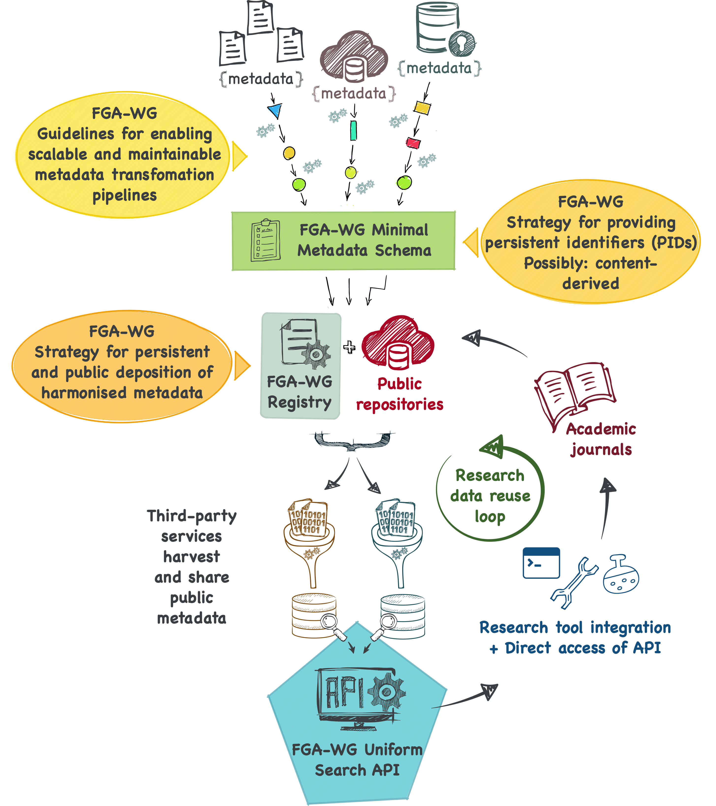

# FAIRification of Genomic Annotations WG (FGA-WG)
Main repository for the FAIRification of Genomic Annotations WG in the Research Data Alliance (RDA)

## Conceptual illustration of the infrastructure to be defined by the FGA-WG

