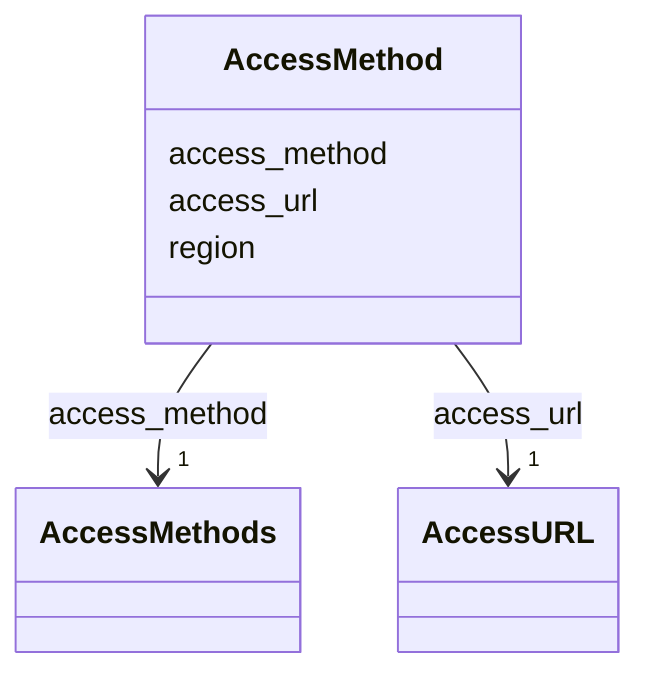

---
search:
  boost: 10.0
---

# Class: AccessMethod 


_Description of an access method (i.e. communication protocol) that can be used to fetch a File object (orig: DrsObject). Exact copy of the AccessMethod object of the GA4GH DRS data model (https://ga4gh.github.io/data-repository-service-schemas/preview/release/drs-1.4.0/docs/#tag/AccessMethodModel)_


<div data-search-exclude markdown="1">


URI: [https://w3id.org/fga-wg/schema/top_level/AccessMethod](https://w3id.org/fga-wg/schema/top_level/AccessMethod)





## Example

<details>
<summary>Example JSON</summary>

```json
{
  "access_method": "https",
  "access_url": {
    "url": "https://epigenomesportal.ca/tracks/ENCODE/hg38/87234.ENCODE.ENCBS004ENC.H3K9me3.peak_calls.bigBed"
  }
}
```
</details>


<!-- no inheritance hierarchy -->

## Slots

| Name | Cardinality and Range | Description | Inheritance |
| ---  | --- | --- | --- |
| [access_method](access_method.md) | 1 <br/> [AccessMethods](AccessMethods.md) | Access method used to access the File object (orig: DrsObject) | direct |
| [access_url](access_url.md) | 1 <br/> [AccessURL](AccessURL.md) | AccessURL object providing URL and associated HTTP headers to access the File... | direct |
| [region](region.md) | 0..1 <br/> [String](String.md) | Name of the region in the cloud service provider that the object belongs to | direct |


## Usages

| used by | used in | type | used |
| ---  | --- | --- | --- |
| [File](File.md) | [access_methods](access_methods.md) | range | [AccessMethod](AccessMethod.md) |
| [GenomicAnnotationFile](GenomicAnnotationFile.md) | [access_methods](access_methods.md) | range | [AccessMethod](AccessMethod.md) |


## Identifier and Mapping Information


### Schema Source


* from schema: https://w3id.org/fga-wg/schema/top_level


## Mappings

| Mapping Type | Mapped Value |
| ---  | ---  |
| self | https://w3id.org/fga-wg/schema/top_level/AccessMethod |
| native | https://w3id.org/fga-wg/schema/top_level/AccessMethod |


## LinkML Source

<!-- TODO: investigate https://stackoverflow.com/questions/37606292/how-to-create-tabbed-code-blocks-in-mkdocs-or-sphinx -->

### Direct

<details>
```yaml
name: AccessMethod
description: 'Description of an access method (i.e. communication protocol) that can
  be used to fetch a File object (orig: DrsObject). Exact copy of the AccessMethod
  object of the GA4GH DRS data model (https://ga4gh.github.io/data-repository-service-schemas/preview/release/drs-1.4.0/docs/#tag/AccessMethodModel)'
from_schema: https://w3id.org/fga-wg/schema/top_level
slots:
- access_method
- access_url
- region

```
</details>

### Induced

<details>
```yaml
name: AccessMethod
description: 'Description of an access method (i.e. communication protocol) that can
  be used to fetch a File object (orig: DrsObject). Exact copy of the AccessMethod
  object of the GA4GH DRS data model (https://ga4gh.github.io/data-repository-service-schemas/preview/release/drs-1.4.0/docs/#tag/AccessMethodModel)'
from_schema: https://w3id.org/fga-wg/schema/top_level
attributes:
  access_method:
    name: access_method
    description: 'Access method used to access the File object (orig: DrsObject).'
    examples:
    - value: https
    from_schema: https://w3id.org/fga-wg/schema/top_level
    rank: 1000
    owner: AccessMethod
    domain_of:
    - AccessMethod
    range: AccessMethods
    required: true
  access_url:
    name: access_url
    description: 'AccessURL object providing URL and associated HTTP headers to access
      the File object (orig: DrsObject).'
    examples:
    - object:
        url: https://epigenomesportal.ca/tracks/ENCODE/hg38/87234.ENCODE.ENCBS004ENC.H3K9me3.peak_calls.bigBed
    from_schema: https://w3id.org/fga-wg/schema/top_level
    rank: 1000
    owner: AccessMethod
    domain_of:
    - AccessMethod
    range: AccessURL
    required: true
  region:
    name: region
    description: Name of the region in the cloud service provider that the object
      belongs to.
    from_schema: https://w3id.org/fga-wg/schema/top_level
    rank: 1000
    owner: AccessMethod
    domain_of:
    - AccessMethod
    range: string

```
</details></div>