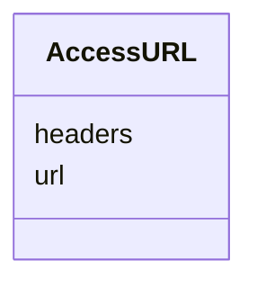

---
search:
  boost: 10.0
---

# Class: AccessURL 


_The URL and associated HTTP headers to access the File object (orig: DrsObject). Exact copy of AccessURL object of the GA4GH DRS data model (https://ga4gh.github.io/data-repository-service-schemas/preview/release/drs-1.4.0/docs/#tag/AccessURLModel)._


<div data-search-exclude markdown="1">


URI: [https://w3id.org/fga-wg/schema/top_level/AccessURL](https://w3id.org/fga-wg/schema/top_level/AccessURL)





<!-- no inheritance hierarchy -->

## Slots

| Name | Cardinality and Range | Description | Inheritance |
| ---  | --- | --- | --- |
| [url](url.md) | 1 <br/> [Uri](Uri.md) | A fully resolvable URL that can be used to fetch the actual object bytes | direct |
| [headers](headers.md) | * <br/> [String](String.md) | An optional list of headers to include in the HTTP request to `url` | direct |


## Usages

| used by | used in | type | used |
| ---  | --- | --- | --- |
| [AccessMethod](AccessMethod.md) | [access_url](access_url.md) | range | [AccessURL](AccessURL.md) |


## Identifier and Mapping Information


### Schema Source


* from schema: https://w3id.org/fga-wg/schema/top_level


## Mappings

| Mapping Type | Mapped Value |
| ---  | ---  |
| self | https://w3id.org/fga-wg/schema/top_level/AccessURL |
| native | https://w3id.org/fga-wg/schema/top_level/AccessURL |


## LinkML Source

<!-- TODO: investigate https://stackoverflow.com/questions/37606292/how-to-create-tabbed-code-blocks-in-mkdocs-or-sphinx -->

### Direct

<details>
```yaml
name: AccessURL
description: 'The URL and associated HTTP headers to access the File object (orig:
  DrsObject). Exact copy of AccessURL object of the GA4GH DRS data model (https://ga4gh.github.io/data-repository-service-schemas/preview/release/drs-1.4.0/docs/#tag/AccessURLModel).'
from_schema: https://w3id.org/fga-wg/schema/top_level
slots:
- url
- headers

```
</details>

### Induced

<details>
```yaml
name: AccessURL
description: 'The URL and associated HTTP headers to access the File object (orig:
  DrsObject). Exact copy of AccessURL object of the GA4GH DRS data model (https://ga4gh.github.io/data-repository-service-schemas/preview/release/drs-1.4.0/docs/#tag/AccessURLModel).'
from_schema: https://w3id.org/fga-wg/schema/top_level
attributes:
  url:
    name: url
    description: A fully resolvable URL that can be used to fetch the actual object
      bytes.
    examples:
    - value: https://epigenomesportal.ca/tracks/ENCODE/hg38/87234.ENCODE.ENCBS004ENC.H3K9me3.peak_calls.bigBed
    from_schema: https://w3id.org/fga-wg/schema/top_level
    rank: 1000
    owner: AccessURL
    domain_of:
    - AccessURL
    range: uri
    required: true
  headers:
    name: headers
    description: An optional list of headers to include in the HTTP request to `url`.
      These headers can be used to provide auth tokens required to fetch the object
      bytes.
    from_schema: https://w3id.org/fga-wg/schema/top_level
    rank: 1000
    owner: AccessURL
    domain_of:
    - AccessURL
    range: string
    multivalued: true

```
</details></div>