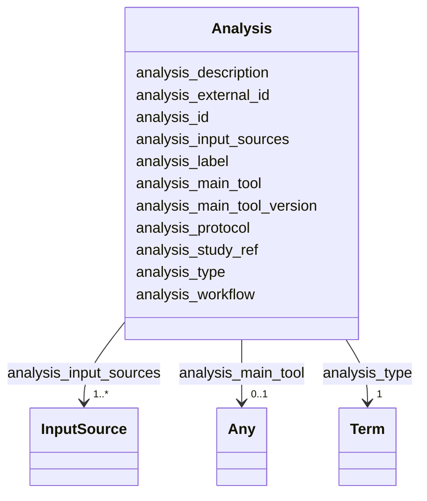

# Class: Analysis 


_Represents the computational processing applied to data from a sequencing experiment, or from another analysis. This can be described at the level of individual analysis steps in a workflow/pipeline, or more generally for the workflow/pipeline as a whole._


URI: [https://w3id.org/fga-wg/schema/top_level/Analysis](https://w3id.org/fga-wg/schema/top_level/Analysis)





<!-- no inheritance hierarchy -->

## Slots

| Name | Cardinality and Range | Description | Inheritance |
| ---  | --- | --- | --- |
| [analysis_external_id](analysis_external_id.md) | 0..1 <br/> [Curie](Curie.md) | External, globally unique identifier for the experiment | direct |
| [analysis_id](analysis_id.md) | 1 <br/> [Curie](Curie.md) | Internal identifier for the experiment (unique within the metadata deposit) | direct |
| [analysis_label](analysis_label.md) | 1 <br/> [String](String.md) | A human-readable description of the analysis, short enough to be used for lis... | direct |
| [analysis_description](analysis_description.md) | 0..1 <br/> [String](String.md) | Human-readable description of the analysis | direct |
| [analysis_study_ref](analysis_study_ref.md) | 0..1 <br/> [Curie](Curie.md) | Internal reference to the study within which the analysis has been carried ou... | direct |
| [analysis_input_sources](analysis_input_sources.md) | 1..* <br/> [InputSource](InputSource.md) | External or internal references to sources for the input data analyzed | direct |
| [analysis_type](analysis_type.md) | 1 <br/> [Term](Term.md) | The type of analysis carried out | direct |
| [analysis_main_tool](analysis_main_tool.md) | 0..1 <br/> [Curie](Curie.md)&nbsp;or&nbsp;<br />[Any](Any.md)&nbsp;or&nbsp;<br />[String](String.md) | Main software tool used for the analysis | direct |
| [analysis_main_tool_version](analysis_main_tool_version.md) | 0..1 <br/> [String](String.md) | Version of the main software tool used for the analysis | direct |
| [analysis_protocol](analysis_protocol.md) | 0..1 <br/> [Uriorcurie](Uriorcurie.md) | Document describing the analysis protocol that was followed | direct |
| [analysis_workflow](analysis_workflow.md) | 0..1 <br/> [Uriorcurie](Uriorcurie.md) | External reference to the analysis workflow, with availability in at least on... | direct |


## Usages

| used by | used in | type | used |
| ---  | --- | --- | --- |
| [TopLevel](TopLevel.md) | [analyses](analyses.md) | range | [Analysis](Analysis.md) |


## Identifier and Mapping Information


### Schema Source


* from schema: https://w3id.org/fga-wg/schema/top_level


## Mappings

| Mapping Type | Mapped Value |
| ---  | ---  |
| self | https://w3id.org/fga-wg/schema/top_level/Analysis |
| native | https://w3id.org/fga-wg/schema/top_level/Analysis |


## LinkML Source

<!-- TODO: investigate https://stackoverflow.com/questions/37606292/how-to-create-tabbed-code-blocks-in-mkdocs-or-sphinx -->

### Direct

<details>
```yaml
name: Analysis
description: Represents the computational processing applied to data from a sequencing
  experiment, or from another analysis. This can be described at the level of individual
  analysis steps in a workflow/pipeline, or more generally for the workflow/pipeline
  as a whole.
from_schema: https://w3id.org/fga-wg/schema/top_level
slots:
- analysis_external_id
- analysis_id
- analysis_label
- analysis_description
- analysis_study_ref
- analysis_input_sources
- analysis_type
- analysis_main_tool
- analysis_main_tool_version
- analysis_protocol
- analysis_workflow

```
</details>

### Induced

<details>
```yaml
name: Analysis
description: Represents the computational processing applied to data from a sequencing
  experiment, or from another analysis. This can be described at the level of individual
  analysis steps in a workflow/pipeline, or more generally for the workflow/pipeline
  as a whole.
from_schema: https://w3id.org/fga-wg/schema/top_level
attributes:
  analysis_external_id:
    name: analysis_external_id
    description: External, globally unique identifier for the experiment.
    examples:
    - value: encode:ENCAN718KHT
    from_schema: https://w3id.org/fga-wg/schema/top_level
    rank: 1000
    alias: analysis_external_id
    owner: Analysis
    domain_of:
    - Analysis
    range: curie
  analysis_id:
    name: analysis_id
    description: 'Internal identifier for the experiment (unique within the metadata
      deposit). '
    examples:
    - value: analysis:ENCAN718KHT
    from_schema: https://w3id.org/fga-wg/schema/top_level
    rank: 1000
    identifier: true
    alias: analysis_id
    owner: Analysis
    domain_of:
    - Analysis
    range: curie
    required: true
  analysis_label:
    name: analysis_label
    description: A human-readable description of the analysis, short enough to be
      used for listings within software user interfaces, tables, illustration legends,
      etc.
    examples:
    - value: ENCODE3 ChIP-seq pipeline, GRCH38, replicated peak calling
    from_schema: https://w3id.org/fga-wg/schema/top_level
    rank: 1000
    alias: analysis_label
    owner: Analysis
    domain_of:
    - Analysis
    range: string
    required: true
    pattern: ^.{1,60}$
  analysis_description:
    name: analysis_description
    description: Human-readable description of the analysis.
    examples:
    - value: ENCODE3 ChIP-seq pipeline on GRCH38 with replicated peak calling using
        MACS.
    from_schema: https://w3id.org/fga-wg/schema/top_level
    rank: 1000
    alias: analysis_description
    owner: Analysis
    domain_of:
    - Analysis
    range: string
  analysis_study_ref:
    name: analysis_study_ref
    description: Internal reference to the study within which the analysis has been
      carried out.
    examples:
    - value: study:S-EPMC7391744
    from_schema: https://w3id.org/fga-wg/schema/top_level
    rank: 1000
    alias: analysis_study_ref
    owner: Analysis
    domain_of:
    - Analysis
    range: curie
  analysis_input_sources:
    name: analysis_input_sources
    description: External or internal references to sources for the input data analyzed.
      Internal references should lead to FileCollection, File, Experiment, or Analysis
      objects.
    examples:
    - object:
        inputsource_ref: experiment:ENCSR000DPJ
        qualified_relation: prov:wasInformedBy
        biological_replicate_labels:
        - '1'
        - '2'
        technical_replicate_labels:
        - '1_1'
        - '2_1'
    - object:
        inputsource_external_ref: https://www.encodeproject.org/files/GRCh38_no_alt_analysis_set_GCA_000001405.15
        qualified_relation: https://bioschemas.org/FormalParameter
        biological_replicate_labels:
        - '1'
        - '2'
        technical_replicate_labels:
        - '1_1'
        - '2_1'
        date_retrieved: '2016-04-19'
    from_schema: https://w3id.org/fga-wg/schema/top_level
    rank: 1000
    alias: analysis_input_sources
    owner: Analysis
    domain_of:
    - Analysis
    range: InputSource
    required: true
    multivalued: true
  analysis_type:
    name: analysis_type
    description: The type of analysis carried out.
    examples:
    - object:
        id: edam:operation_3222
        label: Peak calling
    from_schema: https://w3id.org/fga-wg/schema/top_level
    rank: 1000
    alias: analysis_type
    owner: Analysis
    domain_of:
    - Analysis
    range: Term
    required: true
  analysis_main_tool:
    name: analysis_main_tool
    description: Main software tool used for the analysis.
    examples:
    - value: biotools:macs
    from_schema: https://w3id.org/fga-wg/schema/top_level
    rank: 1000
    alias: analysis_main_tool
    owner: Analysis
    domain_of:
    - Analysis
    range: Any
    any_of:
    - range: string
    - range: curie
  analysis_main_tool_version:
    name: analysis_main_tool_version
    description: Version of the main software tool used for the analysis.
    examples:
    - value: '2.10'
    from_schema: https://w3id.org/fga-wg/schema/top_level
    rank: 1000
    alias: analysis_main_tool_version
    owner: Analysis
    domain_of:
    - Analysis
    range: string
  analysis_protocol:
    name: analysis_protocol
    description: Document describing the analysis protocol that was followed.
    examples:
    - value: https://www.encodeproject.org/documents/7009beb8-340b-4e71-b9db-53bb020c7fe2/@@download/attachment/ChIP-seq_pipeline_overview.pdf
    from_schema: https://w3id.org/fga-wg/schema/top_level
    rank: 1000
    alias: analysis_protocol
    owner: Analysis
    domain_of:
    - Analysis
    range: uriorcurie
  analysis_workflow:
    name: analysis_workflow
    description: External reference to the analysis workflow, with availability in
      at least one machine-operable form (e.g. CWL, Nextflow, ...).
    examples:
    - value: encode:ENCPL272XAE
    from_schema: https://w3id.org/fga-wg/schema/top_level
    rank: 1000
    alias: analysis_workflow
    owner: Analysis
    domain_of:
    - Analysis
    range: uriorcurie

```
</details>