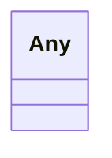

---
search:
  boost: 10.0
---

# Class: Any 


_The Any allows the range of a slot to be any object (see https://linkml.io/linkml/schemas/advanced.html#linkml-any-type)._


<div data-search-exclude markdown="1">


URI: [linkml:Any](https://w3id.org/linkml/Any)





<!-- no inheritance hierarchy -->

## Class Properties

| Property | Value |
| --- | --- |
| Class URI | [linkml:Any](https://w3id.org/linkml/Any) |


## Slots

| Name | Cardinality and Range | Description | Inheritance |
| ---  | --- | --- | --- |


## Usages

| used by | used in | type | used |
| ---  | --- | --- | --- |
| [InputSource](InputSource.md) | [database_accessions](database_accessions.md) | range | [Any](Any.md) |
| [Analysis](Analysis.md) | [analysis_main_tool](analysis_main_tool.md) | range | [Any](Any.md) |
| [Document](Document.md) | [document_description](document_description.md) | range | [Any](Any.md) |
| [FileCollection](FileCollection.md) | [filecollection_description](filecollection_description.md) | range | [Any](Any.md) |
| [QualityAssessment](QualityAssessment.md) | [assessment_method](assessment_method.md) | range | [Any](Any.md) |
| [QualityAssessment](QualityAssessment.md) | [assessment_values](assessment_values.md) | range | [Any](Any.md) |
| [AssessmentValue](AssessmentValue.md) | [value](value.md) | range | [Any](Any.md) |


## Identifier and Mapping Information


### Schema Source


* from schema: https://w3id.org/fga-wg/schema/top_level


## Mappings

| Mapping Type | Mapped Value |
| ---  | ---  |
| self | linkml:Any |
| native | https://w3id.org/fga-wg/schema/top_level/Any |


## LinkML Source

<!-- TODO: investigate https://stackoverflow.com/questions/37606292/how-to-create-tabbed-code-blocks-in-mkdocs-or-sphinx -->

### Direct

<details>
```yaml
name: Any
description: The Any allows the range of a slot to be any object (see https://linkml.io/linkml/schemas/advanced.html#linkml-any-type).
from_schema: https://w3id.org/fga-wg/schema/top_level
class_uri: linkml:Any

```
</details>

### Induced

<details>
```yaml
name: Any
description: The Any allows the range of a slot to be any object (see https://linkml.io/linkml/schemas/advanced.html#linkml-any-type).
from_schema: https://w3id.org/fga-wg/schema/top_level
class_uri: linkml:Any

```
</details></div>