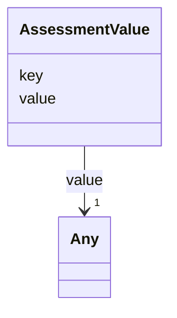

---
search:
  boost: 10.0
---

# Class: AssessmentValue 


_Key-value pair representing a specific value produced by a quality assessment._


<div data-search-exclude markdown="1">


URI: [https://w3id.org/fga-wg/schema/bundle/AssessmentValue](https://w3id.org/fga-wg/schema/bundle/AssessmentValue)





<!-- no inheritance hierarchy -->

## Slots

| Name | Cardinality and Range | Description | Inheritance |
| ---  | --- | --- | --- |
| [key](key.md) | 1 <br/> [String](String.md) | Key/name of the assessment value. | direct |
| [value](value.md) | 1 <br/> [Any](Any.md)&nbsp;or&nbsp;<br />[Decimal](Decimal.md)&nbsp;or&nbsp;<br />[Boolean](Boolean.md)&nbsp;or&nbsp;<br />[Integer](Integer.md)&nbsp;or&nbsp;<br />[String](String.md) | Value corresponding to the assessment key. | direct |


## Usages

| used by | used in | type | used |
| ---  | --- | --- | --- |
| [QualityAssessment](QualityAssessment.md) | [assessment_values](assessment_values.md) | any_of[range] | [AssessmentValue](AssessmentValue.md) |


## Identifier and Mapping Information


### Schema Source


* from schema: https://w3id.org/fga-wg/schema/bundle


## Mappings

| Mapping Type | Mapped Value |
| ---  | ---  |
| self | https://w3id.org/fga-wg/schema/bundle/AssessmentValue |
| native | https://w3id.org/fga-wg/schema/bundle/AssessmentValue |


## LinkML Source

<!-- TODO: investigate https://stackoverflow.com/questions/37606292/how-to-create-tabbed-code-blocks-in-mkdocs-or-sphinx -->

### Direct

<details>
```yaml
name: AssessmentValue
description: Key-value pair representing a specific value produced by a quality assessment.
from_schema: https://w3id.org/fga-wg/schema/bundle
slots:
- key
- value

```
</details>

### Induced

<details>
```yaml
name: AssessmentValue
description: Key-value pair representing a specific value produced by a quality assessment.
from_schema: https://w3id.org/fga-wg/schema/bundle
attributes:
  key:
    name: key
    description: Key/name of the assessment value.
    from_schema: https://w3id.org/fga-wg/schema/bundle
    rank: 1000
    identifier: true
    owner: AssessmentValue
    domain_of:
    - AssessmentValue
    range: string
    required: true
  value:
    name: value
    description: Value corresponding to the assessment key.
    from_schema: https://w3id.org/fga-wg/schema/bundle
    rank: 1000
    owner: AssessmentValue
    domain_of:
    - AssessmentValue
    range: Any
    required: true
    any_of:
    - range: decimal
    - range: boolean
    - range: integer
    - range: string

```
</details></div>