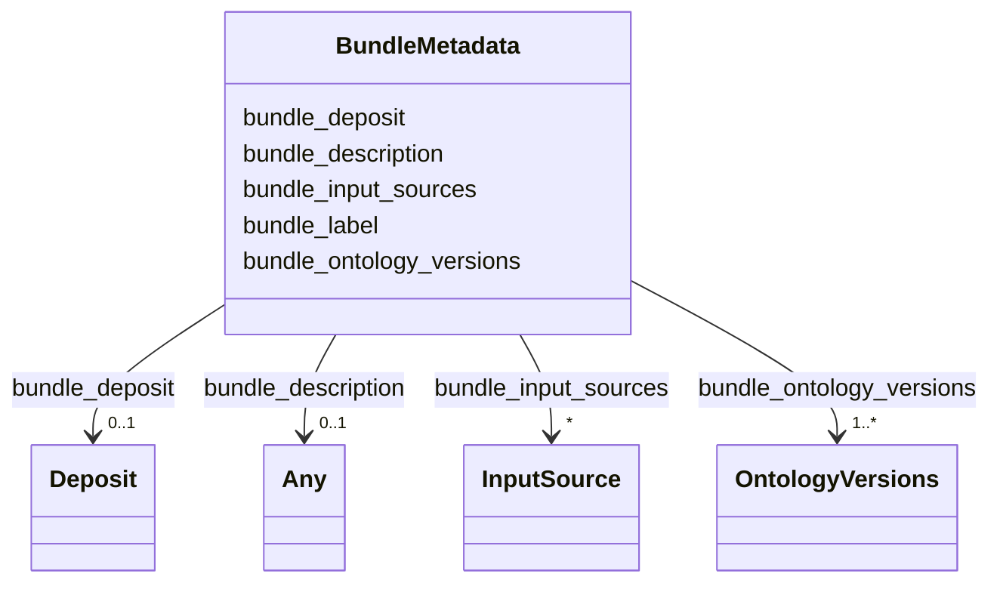

---
search:
  boost: 10.0
---

# Class: BundleMetadata 


_Top-level metadata about a bundle representing a set of genome annotation files, harmonised according to the "FAIRification of Genomic Annotations" data model.  This includes self-referential identifiers and versioning of public deposits of the harmonized metadata._


<div data-search-exclude markdown="1">


URI: [https://w3id.org/fga-wg/schema/bundle/BundleMetadata](https://w3id.org/fga-wg/schema/bundle/BundleMetadata)





## Example

<details>
<summary>Example JSON</summary>

```json
{
  "bundle_deposit": {
    "deposit_first_created": "2025-07-01T12:36:00Z",
    "deposit_id": "doi:10.1234/zenodo.12345678",
    "deposit_last_changed": "2025-07-01T12:36:00Z",
    "deposit_versioned_id": "doi:10.1234/zenodo.12345679"
  },
  "bundle_description": "The metadata contents of the International Human Epigenome Consortium (IHEC) data portal, harmonised to follow the metadata model developed by the \"FAIRification of Genomic Annotations WG\" in the Research Data Alliance (RDA), enhanced with metadata from original sources.",
  "bundle_input_sources": [
    {
      "inputsource_external_ref": "https://epigenomesportal.ca/ihec/",
      "qualified_relation": "prov:wasDerivedFrom"
    }
  ],
  "bundle_label": "IHEC data portal metadata, harmonised to the FGA-WG model.",
  "bundle_ontology_versions": [
    {
      "namespace": "edam",
      "ontology_url": "http://edamontology.org/EDAM.owl",
      "versioned_ontology_url": "http://edamontology.org/EDAM_1.21.owl"
    },
    {
      "namespace": "cl",
      "ontology_url": "http://purl.obolibrary.org/obo/cl.owl",
      "versioned_ontology_url": "http://purl.obolibrary.org/obo/cl/releases/2020-05-21/cl.owl"
    },
    {
      "namespace": "efo",
      "ontology_url": "http://www.ebi.ac.uk/efo/efo.owl",
      "versioned_ontology_url": "http://www.ebi.ac.uk/efo/releases/v3.21.0/efo.owl"
    },
    {
      "namespace": "ncit",
      "ontology_url": "http://purl.obolibrary.org/obo/ncit.owl",
      "versioned_ontology_url": "http://purl.obolibrary.org/obo/ncit/releases/2020-07-17/ncit.owl"
    },
    {
      "namespace": "obi",
      "ontology_url": "http://purl.obolibrary.org/obo/obi.owl",
      "versioned_ontology_url": "http://purl.obolibrary.org/obo/obi/2020-04-23/obi.owl"
    },
    {
      "namespace": "so",
      "ontology_url": "http://purl.obolibrary.org/obo/so.owl",
      "versioned_ontology_url": "http://purl.obolibrary.org/obo/so/2020-08-20/so.owl"
    },
    {
      "namespace": "uberon",
      "ontology_url": "http://purl.obolibrary.org/obo/uberon.owl",
      "versioned_ontology_url": "http://purl.obolibrary.org/obo/uberon/releases/2020-06-30/uberon.owl"
    }
  ]
}
```
</details>


<!-- no inheritance hierarchy -->

## Slots

| Name | Cardinality and Range | Description | Inheritance |
| ---  | --- | --- | --- |
| [bundle_label](bundle_label.md) | 1 <br/> [String](String.md) | A human-readable description of the bundle, short enough to be used for listings within software user interfaces, tables, illustration legends, etc. | direct |
| [bundle_description](bundle_description.md) | 0..1 <br/> [Any](Any.md)&nbsp;or&nbsp;<br />[String](String.md)&nbsp;or&nbsp;<br />[Uri](Uri.md) | Human-readable description of the bundle. | direct |
| [bundle_deposit](bundle_deposit.md) | 0..1 <br/> [Deposit](Deposit.md) | Information about the public deposit of the bundle. | direct |
| [bundle_input_sources](bundle_input_sources.md) | * <br/> [InputSource](InputSource.md) | References to other input sources from which this entire bundle was derived, or possibly including DOIs of other bundles used as source. | direct |
| [bundle_ontology_versions](bundle_ontology_versions.md) | 1..* <br/> [OntologyVersions](OntologyVersions.md) | Map from the version-agnostic URL to a versioned URL (e.g. "versionIRI" in owl) of each ontology used in the current metadata deposit (corresponding to deposit_versioned_id"). | direct |


## Usages

| used by | used in | type | used |
| ---  | --- | --- | --- |
| [Bundle](Bundle.md) | [bundle_metadata](bundle_metadata.md) | range | [BundleMetadata](BundleMetadata.md) |


## Identifier and Mapping Information


### Schema Source


* from schema: https://w3id.org/fga-wg/schema/bundle


## Mappings

| Mapping Type | Mapped Value |
| ---  | ---  |
| self | https://w3id.org/fga-wg/schema/bundle/BundleMetadata |
| native | https://w3id.org/fga-wg/schema/bundle/BundleMetadata |


## LinkML Source

<!-- TODO: investigate https://stackoverflow.com/questions/37606292/how-to-create-tabbed-code-blocks-in-mkdocs-or-sphinx -->

### Direct

<details>
```yaml
name: BundleMetadata
description: Top-level metadata about a bundle representing a set of genome annotation
  files, harmonised according to the "FAIRification of Genomic Annotations" data model.  This
  includes self-referential identifiers and versioning of public deposits of the harmonized
  metadata.
from_schema: https://w3id.org/fga-wg/schema/bundle
slots:
- bundle_label
- bundle_description
- bundle_deposit
- bundle_input_sources
- bundle_ontology_versions

```
</details>

### Induced

<details>
```yaml
name: BundleMetadata
description: Top-level metadata about a bundle representing a set of genome annotation
  files, harmonised according to the "FAIRification of Genomic Annotations" data model.  This
  includes self-referential identifiers and versioning of public deposits of the harmonized
  metadata.
from_schema: https://w3id.org/fga-wg/schema/bundle
attributes:
  bundle_label:
    name: bundle_label
    description: A human-readable description of the bundle, short enough to be used
      for listings within software user interfaces, tables, illustration legends,
      etc.
    examples:
    - value: IHEC data portal metadata, harmonised to the FGA-WG model.
    from_schema: https://w3id.org/fga-wg/schema/bundle
    rank: 1000
    owner: BundleMetadata
    domain_of:
    - BundleMetadata
    range: string
    required: true
    pattern: ^.{1,60}$
  bundle_description:
    name: bundle_description
    description: Human-readable description of the bundle.
    examples:
    - value: The metadata contents of the International Human Epigenome Consortium
        (IHEC) data portal, harmonised to follow the metadata model developed by the
        "FAIRification of Genomic Annotations WG" in the Research Data Alliance (RDA),
        enhanced with metadata from original sources.
    from_schema: https://w3id.org/fga-wg/schema/bundle
    rank: 1000
    owner: BundleMetadata
    domain_of:
    - BundleMetadata
    range: Any
    any_of:
    - range: string
    - range: uri
  bundle_deposit:
    name: bundle_deposit
    description: Information about the public deposit of the bundle.
    examples:
    - object:
        deposit_id: doi:10.1234/zenodo.12345678
        deposit_versioned_id: doi:10.1234/zenodo.12345679
        deposit_first_created: '2025-07-01T12:36:00Z'
        deposit_last_changed: '2025-07-01T12:36:00Z'
    from_schema: https://w3id.org/fga-wg/schema/bundle
    rank: 1000
    owner: BundleMetadata
    domain_of:
    - BundleMetadata
    range: Deposit
    inlined: true
  bundle_input_sources:
    name: bundle_input_sources
    description: References to other input sources from which this entire bundle was
      derived, or possibly including DOIs of other bundles used as source.
    examples:
    - object:
        inputsource_external_ref: https://epigenomesportal.ca/ihec/
        qualified_relation: prov:wasDerivedFrom
    from_schema: https://w3id.org/fga-wg/schema/bundle
    rank: 1000
    owner: BundleMetadata
    domain_of:
    - BundleMetadata
    range: InputSource
    multivalued: true
  bundle_ontology_versions:
    name: bundle_ontology_versions
    description: Map from the version-agnostic URL to a versioned URL (e.g. "versionIRI"
      in owl) of each ontology used in the current metadata deposit (corresponding
      to deposit_versioned_id").
    examples:
    - object:
        namespace: edam
        ontology_url: http://edamontology.org/EDAM.owl
        versioned_ontology_url: http://edamontology.org/EDAM_1.21.owl
    - object:
        namespace: cl
        ontology_url: http://purl.obolibrary.org/obo/cl.owl
        versioned_ontology_url: http://purl.obolibrary.org/obo/cl/releases/2020-05-21/cl.owl
    - object:
        namespace: efo
        ontology_url: http://www.ebi.ac.uk/efo/efo.owl
        versioned_ontology_url: http://www.ebi.ac.uk/efo/releases/v3.21.0/efo.owl
    - object:
        namespace: ncit
        ontology_url: http://purl.obolibrary.org/obo/ncit.owl
        versioned_ontology_url: http://purl.obolibrary.org/obo/ncit/releases/2020-07-17/ncit.owl
    - object:
        namespace: obi
        ontology_url: http://purl.obolibrary.org/obo/obi.owl
        versioned_ontology_url: http://purl.obolibrary.org/obo/obi/2020-04-23/obi.owl
    - object:
        namespace: so
        ontology_url: http://purl.obolibrary.org/obo/so.owl
        versioned_ontology_url: http://purl.obolibrary.org/obo/so/2020-08-20/so.owl
    - object:
        namespace: uberon
        ontology_url: http://purl.obolibrary.org/obo/uberon.owl
        versioned_ontology_url: http://purl.obolibrary.org/obo/uberon/releases/2020-06-30/uberon.owl
    from_schema: https://w3id.org/fga-wg/schema/bundle
    rank: 1000
    owner: BundleMetadata
    domain_of:
    - BundleMetadata
    range: OntologyVersions
    required: true
    multivalued: true

```
</details></div>