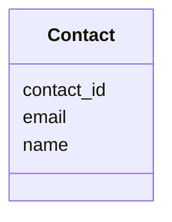

---
search:
  boost: 10.0
---

# Class: Contact 


_Contact information for a person or an organisation._


<div data-search-exclude markdown="1">


URI: [https://w3id.org/fga-wg/schema/bundle/Contact](https://w3id.org/fga-wg/schema/bundle/Contact)





## Example

<details>
<summary>Example JSON</summary>

```json
{
  "contact_id": "orcid:0000-0001-2345-6789",
  "email": "john@doe.com",
  "name": "John Doe"
}
```
</details>


<!-- no inheritance hierarchy -->

## Slots

| Name | Cardinality and Range | Description | Inheritance |
| ---  | --- | --- | --- |
| [name](name.md) | 1 <br/> [String](String.md) | Name of the person or organisation. | direct |
| [contact_id](contact_id.md) | 0..1 <br/> [Curie](Curie.md) | Globally unique identifier for a person (e.g. ORCID ID) or organisation (e.g. BioProject accession). | direct |
| [email](email.md) | 0..1 <br/> [String](String.md) | E-mail address of the person or organisation. | direct |


## Usages

| used by | used in | type | used |
| ---  | --- | --- | --- |
| [FileCollection](FileCollection.md) | [filecollection_contact](filecollection_contact.md) | range | [Contact](Contact.md) |
| [Study](Study.md) | [study_contact](study_contact.md) | range | [Contact](Contact.md) |


## Identifier and Mapping Information


### Schema Source


* from schema: https://w3id.org/fga-wg/schema/bundle


## Mappings

| Mapping Type | Mapped Value |
| ---  | ---  |
| self | https://w3id.org/fga-wg/schema/bundle/Contact |
| native | https://w3id.org/fga-wg/schema/bundle/Contact |


## LinkML Source

<!-- TODO: investigate https://stackoverflow.com/questions/37606292/how-to-create-tabbed-code-blocks-in-mkdocs-or-sphinx -->

### Direct

<details>
```yaml
name: Contact
description: Contact information for a person or an organisation.
from_schema: https://w3id.org/fga-wg/schema/bundle
slots:
- name
- contact_id
- email

```
</details>

### Induced

<details>
```yaml
name: Contact
description: Contact information for a person or an organisation.
from_schema: https://w3id.org/fga-wg/schema/bundle
attributes:
  name:
    name: name
    description: Name of the person or organisation.
    examples:
    - value: John Doe
    from_schema: https://w3id.org/fga-wg/schema/bundle
    rank: 1000
    owner: Contact
    domain_of:
    - Contact
    range: string
    required: true
  contact_id:
    name: contact_id
    description: Globally unique identifier for a person (e.g. ORCID ID) or organisation
      (e.g. BioProject accession).
    examples:
    - value: orcid:0000-0001-2345-6789
    from_schema: https://w3id.org/fga-wg/schema/bundle
    rank: 1000
    owner: Contact
    domain_of:
    - Contact
    range: curie
  email:
    name: email
    description: E-mail address of the person or organisation.
    examples:
    - value: john@doe.com
    from_schema: https://w3id.org/fga-wg/schema/bundle
    rank: 1000
    owner: Contact
    domain_of:
    - Contact
    range: string
    pattern: ^\S+@\S+\.\S+$

```
</details></div>