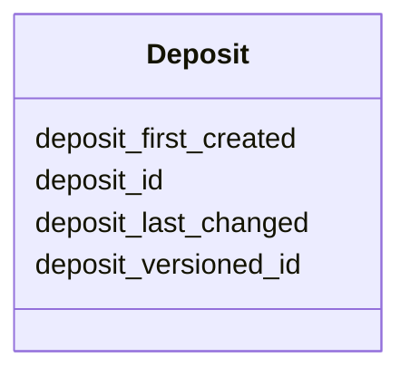

---
search:
  boost: 10.0
---

# Class: Deposit 


_Information about a public deposit of a document containing metadata about a set of genome annotation files._


<div data-search-exclude markdown="1">


URI: [https://w3id.org/fga-wg/schema/top_level/Deposit](https://w3id.org/fga-wg/schema/top_level/Deposit)





## Example

<details>
<summary>Example JSON</summary>

```json
{
  "deposit_first_created": "2025-07-01T12:36:00Z",
  "deposit_id": "doi:10.1234/zenodo.12345678",
  "deposit_last_changed": "2025-07-01T12:36:00Z",
  "deposit_versioned_id": "doi:10.1234/zenodo.12345679"
}
```
</details>


<!-- no inheritance hierarchy -->

## Slots

| Name | Cardinality and Range | Description | Inheritance |
| ---  | --- | --- | --- |
| [deposit_id](deposit_id.md) | 0..1 <br/> [Curie](Curie.md) | A globally unique and persistent identifier for the public deposit of the metadata document. A DOI or other persistent identifier is recommended. | direct |
| [deposit_versioned_id](deposit_versioned_id.md) | 1 <br/> [Curie](Curie.md) | A globally unique, persistent and versioned identifier for the public deposit of the metadata document. A versioned DOI to a deposited document is recommended. | direct |
| [deposit_first_created](deposit_first_created.md) | 1 <br/> [Datetime](Datetime.md) | The date and time of the creation of the first deposited version of the metadata document. | direct |
| [deposit_last_changed](deposit_last_changed.md) | 1 <br/> [Datetime](Datetime.md) | The date and time of the last deposited change of the current metadata document (corresponding to "deposit_versioned_id"). | direct |


## Usages

| used by | used in | type | used |
| ---  | --- | --- | --- |
| [Document](Document.md) | [document_deposit](document_deposit.md) | range | [Deposit](Deposit.md) |


## Identifier and Mapping Information


### Schema Source


* from schema: https://w3id.org/fga-wg/schema/top_level


## Mappings

| Mapping Type | Mapped Value |
| ---  | ---  |
| self | https://w3id.org/fga-wg/schema/top_level/Deposit |
| native | https://w3id.org/fga-wg/schema/top_level/Deposit |


## LinkML Source

<!-- TODO: investigate https://stackoverflow.com/questions/37606292/how-to-create-tabbed-code-blocks-in-mkdocs-or-sphinx -->

### Direct

<details>
```yaml
name: Deposit
description: Information about a public deposit of a document containing metadata
  about a set of genome annotation files.
from_schema: https://w3id.org/fga-wg/schema/top_level
slots:
- deposit_id
- deposit_versioned_id
- deposit_first_created
- deposit_last_changed

```
</details>

### Induced

<details>
```yaml
name: Deposit
description: Information about a public deposit of a document containing metadata
  about a set of genome annotation files.
from_schema: https://w3id.org/fga-wg/schema/top_level
attributes:
  deposit_id:
    name: deposit_id
    description: A globally unique and persistent identifier for the public deposit
      of the metadata document. A DOI or other persistent identifier is recommended.
    examples:
    - value: doi:10.1234/zenodo.12345678
    from_schema: https://w3id.org/fga-wg/schema/top_level
    rank: 1000
    owner: Deposit
    domain_of:
    - Deposit
    range: curie
  deposit_versioned_id:
    name: deposit_versioned_id
    description: A globally unique, persistent and versioned identifier for the public
      deposit of the metadata document. A versioned DOI to a deposited document is
      recommended.
    examples:
    - value: doi:10.1234/zenodo.12345679
    from_schema: https://w3id.org/fga-wg/schema/top_level
    rank: 1000
    identifier: true
    owner: Deposit
    domain_of:
    - Deposit
    range: curie
    required: true
  deposit_first_created:
    name: deposit_first_created
    description: The date and time of the creation of the first deposited version
      of the metadata document.
    examples:
    - value: '2025-07-01T12:36:00Z'
    from_schema: https://w3id.org/fga-wg/schema/top_level
    rank: 1000
    owner: Deposit
    domain_of:
    - Deposit
    range: datetime
    required: true
  deposit_last_changed:
    name: deposit_last_changed
    description: The date and time of the last deposited change of the current metadata
      document (corresponding to "deposit_versioned_id").
    examples:
    - value: '2025-07-01T12:36:00Z'
    from_schema: https://w3id.org/fga-wg/schema/top_level
    rank: 1000
    owner: Deposit
    domain_of:
    - Deposit
    range: datetime
    required: true

```
</details></div>