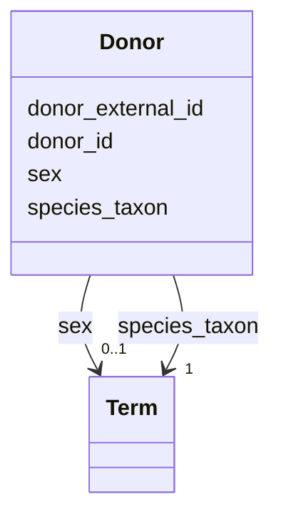

---
search:
  boost: 10.0
---

# Class: Donor 


_Information about the donor or complete organism from which the sample was taken._


<div data-search-exclude markdown="1">


URI: [https://w3id.org/fga-wg/schema/top_level/Donor](https://w3id.org/fga-wg/schema/top_level/Donor)





<!-- no inheritance hierarchy -->

## Slots

| Name | Cardinality and Range | Description | Inheritance |
| ---  | --- | --- | --- |
| [donor_external_id](donor_external_id.md) | 0..1 <br/> [Curie](Curie.md) | External, globally unique identifier for the donor/organism | direct |
| [donor_id](donor_id.md) | 1 <br/> [Curie](Curie.md) | Internal identifier for the donor/organism (unique within the metadata deposi... | direct |
| [species_taxon](species_taxon.md) | 1 <br/> [Term](Term.md) | Taxonomical classification of the species of the donor/organism | direct |
| [sex](sex.md) | 0..1 <br/> [Term](Term.md) | Biological sex of the donor/organism | direct |


## Usages

| used by | used in | type | used |
| ---  | --- | --- | --- |
| [TopLevel](TopLevel.md) | [donors](donors.md) | range | [Donor](Donor.md) |


## Identifier and Mapping Information


### Schema Source


* from schema: https://w3id.org/fga-wg/schema/top_level


## Mappings

| Mapping Type | Mapped Value |
| ---  | ---  |
| self | https://w3id.org/fga-wg/schema/top_level/Donor |
| native | https://w3id.org/fga-wg/schema/top_level/Donor |


## LinkML Source

<!-- TODO: investigate https://stackoverflow.com/questions/37606292/how-to-create-tabbed-code-blocks-in-mkdocs-or-sphinx -->

### Direct

<details>
```yaml
name: Donor
description: Information about the donor or complete organism from which the sample
  was taken.
from_schema: https://w3id.org/fga-wg/schema/top_level
slots:
- donor_external_id
- donor_id
- species_taxon
- sex

```
</details>

### Induced

<details>
```yaml
name: Donor
description: Information about the donor or complete organism from which the sample
  was taken.
from_schema: https://w3id.org/fga-wg/schema/top_level
attributes:
  donor_external_id:
    name: donor_external_id
    description: External, globally unique identifier for the donor/organism.
    examples:
    - value: biosamples:SAMN04284578
    from_schema: https://w3id.org/fga-wg/schema/top_level
    rank: 1000
    owner: Donor
    domain_of:
    - Donor
    range: curie
  donor_id:
    name: donor_id
    description: 'Internal identifier for the donor/organism (unique within the metadata
      deposit). '
    examples:
    - value: donor:ENCDO001AAA
    from_schema: https://w3id.org/fga-wg/schema/top_level
    rank: 1000
    identifier: true
    owner: Donor
    domain_of:
    - Donor
    range: curie
    required: true
  species_taxon:
    name: species_taxon
    description: Taxonomical classification of the species of the donor/organism.
    examples:
    - object:
        id: NCBITaxon:9606
        label: Homo sapiens
    from_schema: https://w3id.org/fga-wg/schema/top_level
    rank: 1000
    owner: Donor
    domain_of:
    - Donor
    range: Term
    required: true
  sex:
    name: sex
    description: Biological sex of the donor/organism.
    examples:
    - object:
        id: CARO:0000027
        label: male organism
    from_schema: https://w3id.org/fga-wg/schema/top_level
    rank: 1000
    owner: Donor
    domain_of:
    - Donor
    range: Term

```
</details></div>