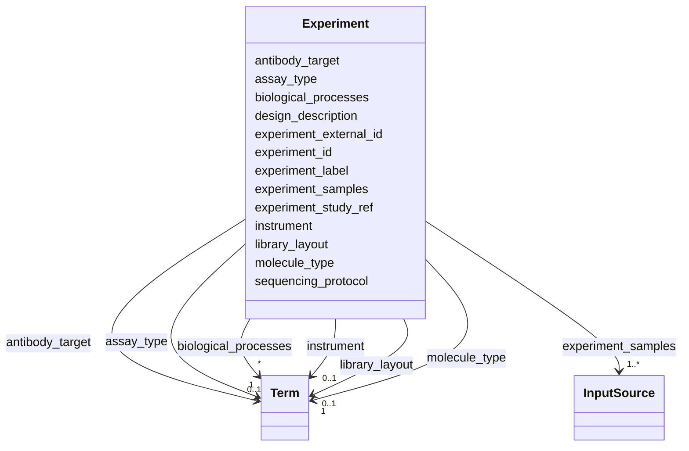

# Class: Experiment 


_Represents a sequencing experiment that has been carried out within a study, based on biological samples, and providing data files as output. Subsequent analysis of output data is described by the Analysis entity._


URI: [https://w3id.org/fga-wg/schema/top_level/Experiment](https://w3id.org/fga-wg/schema/top_level/Experiment)





<!-- no inheritance hierarchy -->

## Slots

| Name | Cardinality and Range | Description | Inheritance |
| ---  | --- | --- | --- |
| [experiment_external_id](experiment_external_id.md) | 0..1 <br/> [Curie](Curie.md) | External, globally unique identifier for the experiment | direct |
| [experiment_id](experiment_id.md) | 1 <br/> [Curie](Curie.md) | Internal identifier for the experiment (unique within the metadata deposit) | direct |
| [experiment_label](experiment_label.md) | 1 <br/> [String](String.md) | A human-readable description of the experiment, short enough to be used for l... | direct |
| [experiment_study_ref](experiment_study_ref.md) | 1 <br/> [Curie](Curie.md) | Internal reference to the study within which the experiment has been carried ... | direct |
| [experiment_samples](experiment_samples.md) | 1..* <br/> [InputSource](InputSource.md) | External or internal references to samples used in the experiment | direct |
| [molecule_type](molecule_type.md) | 1 <br/> [Term](Term.md) | Specifies the type of source material that is being sequenced | direct |
| [assay_type](assay_type.md) | 1 <br/> [Term](Term.md) | Sequencing technique intended for this library | direct |
| [design_description](design_description.md) | 0..1 <br/> [String](String.md) | The high-level experiment design including layout, protocol | direct |
| [library_layout](library_layout.md) | 0..1 <br/> [Term](Term.md) | Whether the library was built as paired-end, or single-end | direct |
| [instrument](instrument.md) | 0..1 <br/> [Term](Term.md) | Technology platform used to perform nucleic acid sequencing, including name a... | direct |
| [sequencing_protocol](sequencing_protocol.md) | 0..1 <br/> [Uriorcurie](Uriorcurie.md) | Set of rules which guides how the sequencing protocol was followed | direct |
| [antibody_target](antibody_target.md) | 0..1 <br/> [Term](Term.md) | The target of the antibody used in the experiment | direct |
| [biological_processes](biological_processes.md) | * <br/> [Term](Term.md) | Biological processes illuminated by the experiment | direct |


## Usages

| used by | used in | type | used |
| ---  | --- | --- | --- |
| [TopLevel](TopLevel.md) | [experiments](experiments.md) | range | [Experiment](Experiment.md) |


## Identifier and Mapping Information


### Schema Source


* from schema: https://w3id.org/fga-wg/schema/top_level


## Mappings

| Mapping Type | Mapped Value |
| ---  | ---  |
| self | https://w3id.org/fga-wg/schema/top_level/Experiment |
| native | https://w3id.org/fga-wg/schema/top_level/Experiment |


## LinkML Source

<!-- TODO: investigate https://stackoverflow.com/questions/37606292/how-to-create-tabbed-code-blocks-in-mkdocs-or-sphinx -->

### Direct

<details>
```yaml
name: Experiment
description: Represents a sequencing experiment that has been carried out within a
  study, based on biological samples, and providing data files as output. Subsequent
  analysis of output data is described by the Analysis entity.
from_schema: https://w3id.org/fga-wg/schema/top_level
slots:
- experiment_external_id
- experiment_id
- experiment_label
- experiment_study_ref
- experiment_samples
- molecule_type
- assay_type
- design_description
- library_layout
- instrument
- sequencing_protocol
- antibody_target
- biological_processes

```
</details>

### Induced

<details>
```yaml
name: Experiment
description: Represents a sequencing experiment that has been carried out within a
  study, based on biological samples, and providing data files as output. Subsequent
  analysis of output data is described by the Analysis entity.
from_schema: https://w3id.org/fga-wg/schema/top_level
attributes:
  experiment_external_id:
    name: experiment_external_id
    description: External, globally unique identifier for the experiment.
    examples:
    - value: encode:ENCSR000DPJ
    from_schema: https://w3id.org/fga-wg/schema/top_level
    rank: 1000
    alias: experiment_external_id
    owner: Experiment
    domain_of:
    - Experiment
    range: curie
  experiment_id:
    name: experiment_id
    description: Internal identifier for the experiment (unique within the metadata
      deposit).
    examples:
    - value: experiment:ENCSR000DPJ
    from_schema: https://w3id.org/fga-wg/schema/top_level
    rank: 1000
    identifier: true
    alias: experiment_id
    owner: Experiment
    domain_of:
    - Experiment
    range: curie
    required: true
  experiment_label:
    name: experiment_label
    description: A human-readable description of the experiment, short enough to be
      used for listings within software user interfaces, tables, illustration legends,
      etc.
    examples:
    - value: H3K9me3 ChIP-seq on human AG04450
    from_schema: https://w3id.org/fga-wg/schema/top_level
    rank: 1000
    alias: experiment_label
    owner: Experiment
    domain_of:
    - Experiment
    range: string
    required: true
    pattern: ^.{1,60}$
  experiment_study_ref:
    name: experiment_study_ref
    description: Internal reference to the study within which the experiment has been
      carried out.
    examples:
    - value: study:E-GEOD-35583
    from_schema: https://w3id.org/fga-wg/schema/top_level
    rank: 1000
    alias: experiment_study_ref
    owner: Experiment
    domain_of:
    - Experiment
    range: curie
    required: true
  experiment_samples:
    name: experiment_samples
    description: External or internal references to samples used in the experiment.
      Internal references should refer to Sample objects.
    examples:
    - object:
        inputsource_ref: sample:ENCBS004ENC
        qualified_relation: prov:used
        biological_replicate_labels:
        - '1'
        - '2'
        technical_replicate_labels:
        - '1_1'
        - '2_1'
    from_schema: https://w3id.org/fga-wg/schema/top_level
    rank: 1000
    alias: experiment_samples
    owner: Experiment
    domain_of:
    - Experiment
    range: InputSource
    required: true
    multivalued: true
  molecule_type:
    name: molecule_type
    description: Specifies the type of source material that is being sequenced.
    examples:
    - object:
        id: SO:0000991
        label: genomic_DNA
    from_schema: https://w3id.org/fga-wg/schema/top_level
    rank: 1000
    alias: molecule_type
    owner: Experiment
    domain_of:
    - Experiment
    range: Term
    required: true
  assay_type:
    name: assay_type
    description: Sequencing technique intended for this library.
    examples:
    - object:
        id: obi:OBI_0000716
        label: ChIP-seq assay
    from_schema: https://w3id.org/fga-wg/schema/top_level
    rank: 1000
    alias: assay_type
    owner: Experiment
    domain_of:
    - Experiment
    range: Term
    required: true
  design_description:
    name: design_description
    description: The high-level experiment design including layout, protocol.
    examples:
    - value: https://www.encodeproject.org/documents/92cd1386-ccad-450a-b5a6-ad49983e7e3f/@@download/attachment/wgEncodeUwHistone.release5.html.pdf
    from_schema: https://w3id.org/fga-wg/schema/top_level
    rank: 1000
    alias: design_description
    owner: Experiment
    domain_of:
    - Experiment
    range: string
  library_layout:
    name: library_layout
    description: Whether the library was built as paired-end, or single-end.
    examples:
    - object:
        id: obi:OBI_0000736
        label: single fragment library
    from_schema: https://w3id.org/fga-wg/schema/top_level
    rank: 1000
    alias: library_layout
    owner: Experiment
    domain_of:
    - Experiment
    range: Term
  instrument:
    name: instrument
    description: Technology platform used to perform nucleic acid sequencing, including
      name and/or number associated with a specific sequencing instrument model. It
      is recommended to be as specific as possible for this property (e.g. if the
      model/revision are available, providing that instead of just the instrument
      maker).
    examples:
    - object:
        id: obi:OBI_0002128
        label: Illumina Genome Analyzer
    from_schema: https://w3id.org/fga-wg/schema/top_level
    rank: 1000
    alias: instrument
    owner: Experiment
    domain_of:
    - Experiment
    range: Term
  sequencing_protocol:
    name: sequencing_protocol
    description: Set of rules which guides how the sequencing protocol was followed.
      Change-tracking services such as Protocol.io or GitHub are encouraged instead
      of dumping free text in this field.
    from_schema: https://w3id.org/fga-wg/schema/top_level
    rank: 1000
    alias: sequencing_protocol
    owner: Experiment
    domain_of:
    - Experiment
    range: uriorcurie
  antibody_target:
    name: antibody_target
    description: The target of the antibody used in the experiment.
    examples:
    - object:
        id: SO:0001707
        label: H3K9Me3
    from_schema: https://w3id.org/fga-wg/schema/top_level
    rank: 1000
    alias: antibody_target
    owner: Experiment
    domain_of:
    - Experiment
    range: Term
  biological_processes:
    name: biological_processes
    description: Biological processes illuminated by the experiment.
    examples:
    - object:
        id: GO:0140999
        label: histone H3K4 trimethyltransferase activity
    from_schema: https://w3id.org/fga-wg/schema/top_level
    rank: 1000
    alias: biological_processes
    owner: Experiment
    domain_of:
    - Experiment
    range: Term
    multivalued: true

```
</details>