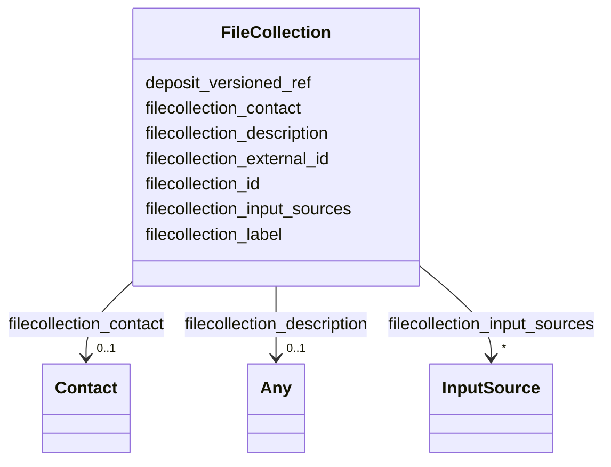

---
search:
  boost: 10.0
---

# Class: FileCollection 


_A collection of files, according to some selection criteria. In the context of the "FAIRification of Genomic Annotations" data model, we are mainly interested in "GenomicAnnotationFile" entities, but other types of files can also be contained in a collection, e.g. raw data files such as FASTQ files._


<div data-search-exclude markdown="1">


URI: [https://w3id.org/fga-wg/schema/top_level/FileCollection](https://w3id.org/fga-wg/schema/top_level/FileCollection)





<!-- no inheritance hierarchy -->

## Slots

| Name | Cardinality and Range | Description | Inheritance |
| ---  | --- | --- | --- |
| [filecollection_external_id](filecollection_external_id.md) | 0..1 <br/> [Curie](Curie.md) | External, globally unique identifier for the file collection (in most cases, ... | direct |
| [filecollection_id](filecollection_id.md) | 1 <br/> [Curie](Curie.md) | Internal identifier for the file collection (unique within the metadata depos... | direct |
| [filecollection_label](filecollection_label.md) | 1 <br/> [String](String.md) | A human-readable description of the file collection, short enough to be used ... | direct |
| [filecollection_description](filecollection_description.md) | 0..1 <br/> [Any](Any.md)&nbsp;or&nbsp;<br />[String](String.md)&nbsp;or&nbsp;<br />[Uri](Uri.md) | Human-readable description of the file collection | direct |
| [filecollection_input_sources](filecollection_input_sources.md) | * <br/> [InputSource](InputSource.md) | References to other input sources from which this file collection was derived | direct |
| [deposit_versioned_ref](deposit_versioned_ref.md) | 1 <br/> [Curie](Curie.md) | Reference to versioned id of deposit containing this file collection | direct |
| [filecollection_contact](filecollection_contact.md) | 0..1 <br/> [Contact](Contact.md) | Contact point to the creator and/or maintainer of the file collection | direct |


## Usages

| used by | used in | type | used |
| ---  | --- | --- | --- |
| [TopLevel](TopLevel.md) | [file_collections](file_collections.md) | range | [FileCollection](FileCollection.md) |


## Identifier and Mapping Information


### Schema Source


* from schema: https://w3id.org/fga-wg/schema/top_level


## Mappings

| Mapping Type | Mapped Value |
| ---  | ---  |
| self | https://w3id.org/fga-wg/schema/top_level/FileCollection |
| native | https://w3id.org/fga-wg/schema/top_level/FileCollection |


## LinkML Source

<!-- TODO: investigate https://stackoverflow.com/questions/37606292/how-to-create-tabbed-code-blocks-in-mkdocs-or-sphinx -->

### Direct

<details>
```yaml
name: FileCollection
description: A collection of files, according to some selection criteria. In the context
  of the "FAIRification of Genomic Annotations" data model, we are mainly interested
  in "GenomicAnnotationFile" entities, but other types of files can also be contained
  in a collection, e.g. raw data files such as FASTQ files.
from_schema: https://w3id.org/fga-wg/schema/top_level
slots:
- filecollection_external_id
- filecollection_id
- filecollection_label
- filecollection_description
- filecollection_input_sources
- deposit_versioned_ref
- filecollection_contact

```
</details>

### Induced

<details>
```yaml
name: FileCollection
description: A collection of files, according to some selection criteria. In the context
  of the "FAIRification of Genomic Annotations" data model, we are mainly interested
  in "GenomicAnnotationFile" entities, but other types of files can also be contained
  in a collection, e.g. raw data files such as FASTQ files.
from_schema: https://w3id.org/fga-wg/schema/top_level
attributes:
  filecollection_external_id:
    name: filecollection_external_id
    description: External, globally unique identifier for the file collection (in
      most cases, this will not exist).
    from_schema: https://w3id.org/fga-wg/schema/top_level
    rank: 1000
    owner: FileCollection
    domain_of:
    - FileCollection
    range: curie
    required: false
  filecollection_id:
    name: filecollection_id
    description: 'Internal identifier for the file collection (unique within the metadata
      deposit). '
    examples:
    - value: filecollection:ihec_encode
    from_schema: https://w3id.org/fga-wg/schema/top_level
    rank: 1000
    identifier: true
    owner: FileCollection
    domain_of:
    - FileCollection
    range: curie
    required: true
  filecollection_label:
    name: filecollection_label
    description: A human-readable description of the file collection, short enough
      to be used for listings within software user interfaces, tables, illustration
      legends, etc.
    examples:
    - value: 'IHEC data portal: ENCODE dataset'
    from_schema: https://w3id.org/fga-wg/schema/top_level
    rank: 1000
    owner: FileCollection
    domain_of:
    - FileCollection
    range: string
    required: true
    pattern: ^.{1,60}$
  filecollection_description:
    name: filecollection_description
    description: Human-readable description of the file collection.
    examples:
    - value: ENCODE dataset in the International Human Epigenome Consortium (IHEC)
        data portal, enhanced with metadata from the ENCODE data portal.
    from_schema: https://w3id.org/fga-wg/schema/top_level
    rank: 1000
    owner: FileCollection
    domain_of:
    - FileCollection
    range: Any
    any_of:
    - range: string
    - range: uri
  filecollection_input_sources:
    name: filecollection_input_sources
    description: References to other input sources from which this file collection
      was derived.
    examples:
    - object:
        inputsource_external_ref: https://epigenomesportal.ca/ihec/grid.html?build=2020-10&assembly=4&institutions=4
        qualified_relation: prov:wasDerivedFrom
        version: 2020-10
    - object:
        inputsource_external_ref: https://www.encodeproject.org
        qualified_relation: prov:hadPrimarySource
    from_schema: https://w3id.org/fga-wg/schema/top_level
    rank: 1000
    owner: FileCollection
    domain_of:
    - FileCollection
    range: InputSource
    multivalued: true
  deposit_versioned_ref:
    name: deposit_versioned_ref
    description: Reference to versioned id of deposit containing this file collection.
    examples:
    - value: doi:10.1234/zenodo.12345679
    from_schema: https://w3id.org/fga-wg/schema/top_level
    rank: 1000
    owner: FileCollection
    domain_of:
    - FileCollection
    range: curie
    required: true
  filecollection_contact:
    name: filecollection_contact
    description: Contact point to the creator and/or maintainer of the file collection.
    examples:
    - object:
        name: International Human Epigenome Consortium
        contact_id: bioproject:PRJNA234466
        email: info@ihec-epigenomes.org
    from_schema: https://w3id.org/fga-wg/schema/top_level
    rank: 1000
    owner: FileCollection
    domain_of:
    - FileCollection
    range: Contact

```
</details></div>