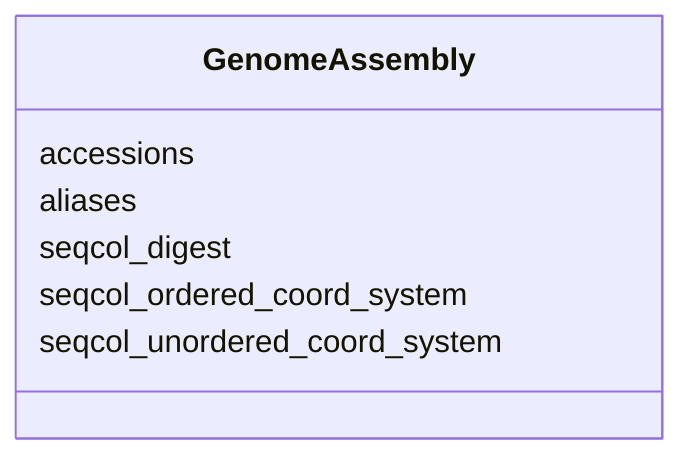

---
search:
  boost: 10.0
---

# Class: GenomeAssembly 


_Information about of the exact genome assembly used to generate the annotation file, defining the genomic coordinate system for the sequence features._


<div data-search-exclude markdown="1">


URI: [https://w3id.org/fga-wg/schema/bundle/GenomeAssembly](https://w3id.org/fga-wg/schema/bundle/GenomeAssembly)





## Example

<details>
<summary>Example JSON</summary>

```json
{
  "accessions": [
    "encode:ENCSR425FOI"
  ],
  "aliases": [
    "GRCh38_no_alt_analysis_set_GCA_000001405.15",
    "GRCh38",
    "hg38"
  ],
  "seqcol_digest": "ga4gh:SC.EiFob05aCWgVU_B_Ae0cypnQut3cxUP1",
  "seqcol_ordered_coord_system": "ga4gh:SC.name_length_pairs.Yyz0Expaluj09xdDYg2Y6VOApvjg05Hf",
  "seqcol_unordered_coord_system": "ga4gh:SC.sorted_name_length_pairs._dMQ5dPUNVx4OGQnDAPmGMkVRWWcYV99"
}
```
</details>


<!-- no inheritance hierarchy -->

## Slots

| Name | Cardinality and Range | Description | Inheritance |
| ---  | --- | --- | --- |
| [seqcol_digest](seqcol_digest.md) | 1 <br/> [Curie](Curie.md) | Top-level sequence collection digest according to the GA4GH refget, Sequence Collections standard (v1.0). This a globally unique identifier for the genome assembly, algorithmically derivable from the genome assembly content. Usage is to uniquely identify the exact genome assembly used and allow detailed comparisons across genome assembly variants (say, variants of the GRCh38 assembly). | direct |
| [seqcol_ordered_coord_system](seqcol_ordered_coord_system.md) | 1 <br/> [Curie](Curie.md) | Content-derived digest that uniquely identifies the ordered coordinate system of the genome assembly. (Coordinate systems with the same sequence names and lengths, but where the sequences are ordered differently, will have different ordered digests.). Usage is the ordered coordinate system digest can be used to uniquely generate a chromSizes file, useful in a number of analysis tools. Definition is the ordered coordinate system digest is defined as the level 1 digest of the name_length_pairs attribute of the sequence collection generated from the genome assembly. | direct |
| [seqcol_unordered_coord_system](seqcol_unordered_coord_system.md) | 1 <br/> [Curie](Curie.md) | Content-derived digest that uniquely identifies the order-invariant coordinate system of the genome assembly. This digest will be shared across all coordinate systems with the same sequence names and lenghts, regardless of the order of the sequences. Usage is the order-invariant coordinate system digest can be used to uniquely describe the coordinate system of a particular genome browser instance and the annotation files that are compatible with it. Definition is the order-invariant coordinate system digest is defined as the level 1 digest of the sorted_name_length_pairs attribute of the sequence collection generated from the genome assembly. | direct |
| [accessions](accessions.md) | * <br/> [String](String.md) | Database accession numbers for the genome assembly, if available. Should precisely identify the genome assembly and be omitted if changes have been made to the assembly after retrieval, such as removing the alternate sequences. | direct |
| [aliases](aliases.md) | 1..* <br/> [Curie](Curie.md) | Human-readable aliases of the genome assembly. Can be imprecise, as preciseness is enforced in the other fields. | direct |


## Usages

| used by | used in | type | used |
| ---  | --- | --- | --- |
| [GenomicAnnotationFile](GenomicAnnotationFile.md) | [genome_assembly](genome_assembly.md) | range | [GenomeAssembly](GenomeAssembly.md) |


## Identifier and Mapping Information


### Schema Source


* from schema: https://w3id.org/fga-wg/schema/bundle


## Mappings

| Mapping Type | Mapped Value |
| ---  | ---  |
| self | https://w3id.org/fga-wg/schema/bundle/GenomeAssembly |
| native | https://w3id.org/fga-wg/schema/bundle/GenomeAssembly |


## LinkML Source

<!-- TODO: investigate https://stackoverflow.com/questions/37606292/how-to-create-tabbed-code-blocks-in-mkdocs-or-sphinx -->

### Direct

<details>
```yaml
name: GenomeAssembly
description: Information about of the exact genome assembly used to generate the annotation
  file, defining the genomic coordinate system for the sequence features.
from_schema: https://w3id.org/fga-wg/schema/bundle
slots:
- seqcol_digest
- seqcol_ordered_coord_system
- seqcol_unordered_coord_system
- accessions
- aliases

```
</details>

### Induced

<details>
```yaml
name: GenomeAssembly
description: Information about of the exact genome assembly used to generate the annotation
  file, defining the genomic coordinate system for the sequence features.
from_schema: https://w3id.org/fga-wg/schema/bundle
attributes:
  seqcol_digest:
    name: seqcol_digest
    description: Top-level sequence collection digest according to the GA4GH refget,
      Sequence Collections standard (v1.0). This a globally unique identifier for
      the genome assembly, algorithmically derivable from the genome assembly content.
      Usage is to uniquely identify the exact genome assembly used and allow detailed
      comparisons across genome assembly variants (say, variants of the GRCh38 assembly).
    examples:
    - value: ga4gh:SC.EiFob05aCWgVU_B_Ae0cypnQut3cxUP1
    from_schema: https://w3id.org/fga-wg/schema/bundle
    rank: 1000
    identifier: true
    owner: GenomeAssembly
    domain_of:
    - GenomeAssembly
    range: curie
    required: true
  seqcol_ordered_coord_system:
    name: seqcol_ordered_coord_system
    description: Content-derived digest that uniquely identifies the ordered coordinate
      system of the genome assembly. (Coordinate systems with the same sequence names
      and lengths, but where the sequences are ordered differently, will have different
      ordered digests.). Usage is the ordered coordinate system digest can be used
      to uniquely generate a chromSizes file, useful in a number of analysis tools.
      Definition is the ordered coordinate system digest is defined as the level 1
      digest of the name_length_pairs attribute of the sequence collection generated
      from the genome assembly.
    examples:
    - value: ga4gh:SC.name_length_pairs.Yyz0Expaluj09xdDYg2Y6VOApvjg05Hf
    from_schema: https://w3id.org/fga-wg/schema/bundle
    rank: 1000
    owner: GenomeAssembly
    domain_of:
    - GenomeAssembly
    range: curie
    required: true
  seqcol_unordered_coord_system:
    name: seqcol_unordered_coord_system
    description: Content-derived digest that uniquely identifies the order-invariant
      coordinate system of the genome assembly. This digest will be shared across
      all coordinate systems with the same sequence names and lenghts, regardless
      of the order of the sequences. Usage is the order-invariant coordinate system
      digest can be used to uniquely describe the coordinate system of a particular
      genome browser instance and the annotation files that are compatible with it.
      Definition is the order-invariant coordinate system digest is defined as the
      level 1 digest of the sorted_name_length_pairs attribute of the sequence collection
      generated from the genome assembly.
    examples:
    - value: ga4gh:SC.sorted_name_length_pairs._dMQ5dPUNVx4OGQnDAPmGMkVRWWcYV99
    from_schema: https://w3id.org/fga-wg/schema/bundle
    rank: 1000
    owner: GenomeAssembly
    domain_of:
    - GenomeAssembly
    range: curie
    required: true
  accessions:
    name: accessions
    description: Database accession numbers for the genome assembly, if available.
      Should precisely identify the genome assembly and be omitted if changes have
      been made to the assembly after retrieval, such as removing the alternate sequences.
    examples:
    - value: encode:ENCSR425FOI
    from_schema: https://w3id.org/fga-wg/schema/bundle
    rank: 1000
    owner: GenomeAssembly
    domain_of:
    - GenomeAssembly
    range: string
    multivalued: true
  aliases:
    name: aliases
    description: Human-readable aliases of the genome assembly. Can be imprecise,
      as preciseness is enforced in the other fields.
    examples:
    - value: GRCh38_no_alt_analysis_set_GCA_000001405.15
    - value: GRCh38
    - value: hg38
    from_schema: https://w3id.org/fga-wg/schema/bundle
    rank: 1000
    owner: GenomeAssembly
    domain_of:
    - GenomeAssembly
    range: curie
    required: true
    multivalued: true

```
</details></div>