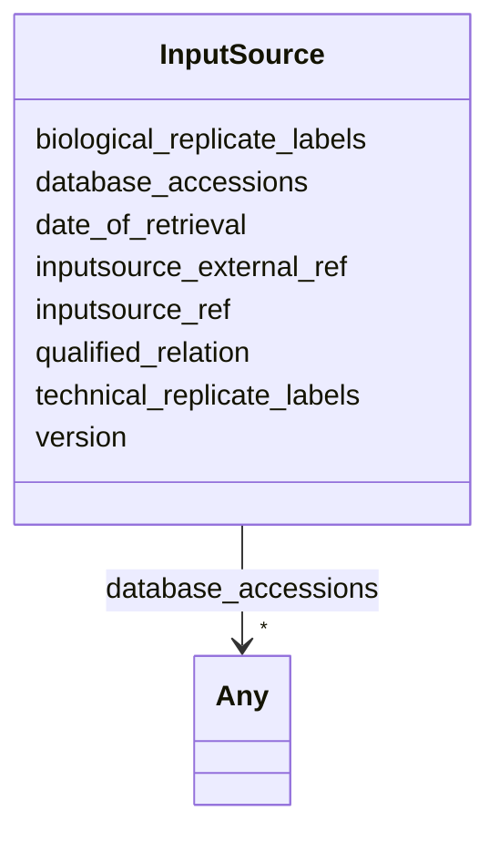

---
search:
  boost: 10.0
---

# Class: InputSource 


_General object representing the source of data files, samples, or other entities used as input to a process or a result. An input source refering to a single file or sample object will represent that item only, while an input source referring to a container or process may represent a number of disctinct input items. InputSource also contains information about the type of relationship, replication labelling, versioning and retrieval date._


<div data-search-exclude markdown="1">


URI: [https://w3id.org/fga-wg/schema/top_level/InputSource](https://w3id.org/fga-wg/schema/top_level/InputSource)





<!-- no inheritance hierarchy -->

## Slots

| Name | Cardinality and Range | Description | Inheritance |
| ---  | --- | --- | --- |
| [inputsource_external_ref](inputsource_external_ref.md) | 0..1 <br/> [Uriorcurie](Uriorcurie.md) | Reference to an external entity as the input source, using a globally unique ... | direct |
| [inputsource_ref](inputsource_ref.md) | 0..1 <br/> [Curie](Curie.md) | Reference to an internal object as the input source using a local identifier | direct |
| [database_accessions](database_accessions.md) | * <br/> [Any](Any.md)&nbsp;or&nbsp;<br />[String](String.md)&nbsp;or&nbsp;<br />[Curie](Curie.md) | Accession numbers for database records used as input source | direct |
| [qualified_relation](qualified_relation.md) | 1 <br/> [Uriorcurie](Uriorcurie.md) | A description of the relationship with the input source | direct |
| [biological_replicate_labels](biological_replicate_labels.md) | * <br/> [String](String.md) | Labels denoting the biological replicates within which the relation is define... | direct |
| [technical_replicate_labels](technical_replicate_labels.md) | * <br/> [String](String.md) | Labels denoting the technical replicates within which the relation is defined... | direct |
| [version](version.md) | 0..1 <br/> [String](String.md) | Version information for the retrieval from the input source | direct |
| [date_of_retrieval](date_of_retrieval.md) | 0..1 <br/> [Date](Date.md) | Date of retrieval from the input source, typically used to timestamp download... | direct |


## Usages

| used by | used in | type | used |
| ---  | --- | --- | --- |
| [Analysis](Analysis.md) | [analysis_input_sources](analysis_input_sources.md) | range | [InputSource](InputSource.md) |
| [Document](Document.md) | [document_input_sources](document_input_sources.md) | range | [InputSource](InputSource.md) |
| [Experiment](Experiment.md) | [experiment_samples](experiment_samples.md) | range | [InputSource](InputSource.md) |
| [File](File.md) | [file_input_sources](file_input_sources.md) | range | [InputSource](InputSource.md) |
| [FileCollection](FileCollection.md) | [filecollection_input_sources](filecollection_input_sources.md) | range | [InputSource](InputSource.md) |
| [GenomicAnnotationFile](GenomicAnnotationFile.md) | [file_input_sources](file_input_sources.md) | range | [InputSource](InputSource.md) |


## Rules


### 

| Rule Applied | Preconditions | Postconditions | Elseconditions |
|--------------|---------------|----------------|----------------|
| slot_conditions |```{'qualified_relation': {'value_presence': 'PRESENT'}}``` | | |


## Identifier and Mapping Information


### Schema Source


* from schema: https://w3id.org/fga-wg/schema/top_level


## Mappings

| Mapping Type | Mapped Value |
| ---  | ---  |
| self | https://w3id.org/fga-wg/schema/top_level/InputSource |
| native | https://w3id.org/fga-wg/schema/top_level/InputSource |


## LinkML Source

<!-- TODO: investigate https://stackoverflow.com/questions/37606292/how-to-create-tabbed-code-blocks-in-mkdocs-or-sphinx -->

### Direct

<details>
```yaml
name: InputSource
description: General object representing the source of data files, samples, or other
  entities used as input to a process or a result. An input source refering to a single
  file or sample object will represent that item only, while an input source referring
  to a container or process may represent a number of disctinct input items. InputSource
  also contains information about the type of relationship, replication labelling,
  versioning and retrieval date.
from_schema: https://w3id.org/fga-wg/schema/top_level
slots:
- inputsource_external_ref
- inputsource_ref
- database_accessions
- qualified_relation
- biological_replicate_labels
- technical_replicate_labels
- version
- date_of_retrieval
rules:
- preconditions:
    slot_conditions:
      qualified_relation:
        name: qualified_relation
        value_presence: PRESENT
  postconditions:
    exactly_one_of:
    - slot_conditions:
        inputsource_external_ref:
          name: inputsource_external_ref
          required: true
    - slot_conditions:
        inputsource_ref:
          name: inputsource_ref
          required: true

```
</details>

### Induced

<details>
```yaml
name: InputSource
description: General object representing the source of data files, samples, or other
  entities used as input to a process or a result. An input source refering to a single
  file or sample object will represent that item only, while an input source referring
  to a container or process may represent a number of disctinct input items. InputSource
  also contains information about the type of relationship, replication labelling,
  versioning and retrieval date.
from_schema: https://w3id.org/fga-wg/schema/top_level
attributes:
  inputsource_external_ref:
    name: inputsource_external_ref
    description: Reference to an external entity as the input source, using a globally
      unique identifier or an URL. External references will in most cases refer to
      a database, data record, data file, website or other data source. One of "inputsource_external_ref"
      or "inputsource_ref" must be specified.
    examples:
    - value: https://www.encodeproject.org/files/GRCh38_no_alt_analysis_set_GCA_000001405.15
    from_schema: https://w3id.org/fga-wg/schema/top_level
    rank: 1000
    owner: InputSource
    domain_of:
    - InputSource
    range: uriorcurie
  inputsource_ref:
    name: inputsource_ref
    description: Reference to an internal object as the input source using a local
      identifier. Entities to be used as an internal input source includes FileCollection,
      Sample, Experiment, Analysis or File as restricted by the description of the
      field where the input source is used. One of "inputsource_external_ref" or "inputsource_ref"
      must be specified.
    from_schema: https://w3id.org/fga-wg/schema/top_level
    rank: 1000
    owner: InputSource
    domain_of:
    - InputSource
    range: curie
  database_accessions:
    name: database_accessions
    description: Accession numbers for database records used as input source. Used
      in connection with "inputsource_external_ref".
    from_schema: https://w3id.org/fga-wg/schema/top_level
    rank: 1000
    owner: InputSource
    domain_of:
    - InputSource
    range: Any
    multivalued: true
    any_of:
    - range: string
    - range: curie
  qualified_relation:
    name: qualified_relation
    description: A description of the relationship with the input source.
    examples:
    - value: bioschemas:FormalParameter
    from_schema: https://w3id.org/fga-wg/schema/top_level
    rank: 1000
    owner: InputSource
    domain_of:
    - InputSource
    range: uriorcurie
    required: true
  biological_replicate_labels:
    name: biological_replicate_labels
    description: Labels denoting the biological replicates within which the relation
      is defined, if any.
    examples:
    - value: '1'
    - value: '2'
    from_schema: https://w3id.org/fga-wg/schema/top_level
    rank: 1000
    owner: InputSource
    domain_of:
    - InputSource
    range: string
    multivalued: true
  technical_replicate_labels:
    name: technical_replicate_labels
    description: Labels denoting the technical replicates within which the relation
      is defined, if any.
    examples:
    - value: '1_1'
    - value: '1_2'
    from_schema: https://w3id.org/fga-wg/schema/top_level
    rank: 1000
    owner: InputSource
    domain_of:
    - InputSource
    range: string
    multivalued: true
  version:
    name: version
    description: Version information for the retrieval from the input source.
    from_schema: https://w3id.org/fga-wg/schema/top_level
    rank: 1000
    owner: InputSource
    domain_of:
    - InputSource
    range: string
  date_of_retrieval:
    name: date_of_retrieval
    description: Date of retrieval from the input source, typically used to timestamp
      downloading data from a database or URL.
    examples:
    - value: '2016-04-19'
    from_schema: https://w3id.org/fga-wg/schema/top_level
    rank: 1000
    owner: InputSource
    domain_of:
    - InputSource
    range: date
rules:
- preconditions:
    slot_conditions:
      qualified_relation:
        name: qualified_relation
        value_presence: PRESENT
  postconditions:
    exactly_one_of:
    - slot_conditions:
        inputsource_external_ref:
          name: inputsource_external_ref
          required: true
    - slot_conditions:
        inputsource_ref:
          name: inputsource_ref
          required: true

```
</details></div>