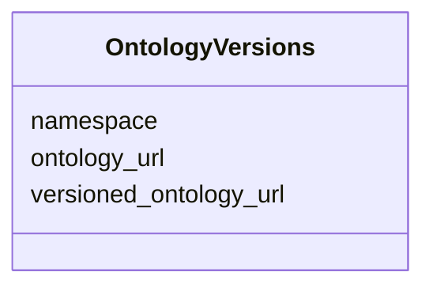

# Class: OntologyVersions 


_Information about an ontology used in the metadata._


URI: [https://w3id.org/fga-wg/schema/top_level/OntologyVersions](https://w3id.org/fga-wg/schema/top_level/OntologyVersions)





<!-- no inheritance hierarchy -->

## Slots

| Name | Cardinality and Range | Description | Inheritance |
| ---  | --- | --- | --- |
| [namespace](namespace.md) | 1 <br/> [String](String.md) | The CURIE namespace (prefix) an ontology (e | direct |
| [ontology_url](ontology_url.md) | 1 <br/> [Uri](Uri.md) | The version-agnostic URL of the ontology (e | direct |
| [versioned_ontology_url](versioned_ontology_url.md) | 1 <br/> [Uri](Uri.md) | The versioned URL of the ontology (e | direct |


## Usages

| used by | used in | type | used |
| ---  | --- | --- | --- |
| [Document](Document.md) | [document_ontology_versions](document_ontology_versions.md) | range | [OntologyVersions](OntologyVersions.md) |


## Identifier and Mapping Information


### Schema Source


* from schema: https://w3id.org/fga-wg/schema/top_level


## Mappings

| Mapping Type | Mapped Value |
| ---  | ---  |
| self | https://w3id.org/fga-wg/schema/top_level/OntologyVersions |
| native | https://w3id.org/fga-wg/schema/top_level/OntologyVersions |


## LinkML Source

<!-- TODO: investigate https://stackoverflow.com/questions/37606292/how-to-create-tabbed-code-blocks-in-mkdocs-or-sphinx -->

### Direct

<details>
```yaml
name: OntologyVersions
description: Information about an ontology used in the metadata.
from_schema: https://w3id.org/fga-wg/schema/top_level
slots:
- namespace
- ontology_url
- versioned_ontology_url

```
</details>

### Induced

<details>
```yaml
name: OntologyVersions
description: Information about an ontology used in the metadata.
from_schema: https://w3id.org/fga-wg/schema/top_level
attributes:
  namespace:
    name: namespace
    description: The CURIE namespace (prefix) an ontology (e.g. "GO" for Gene Ontology).
    examples:
    - value: edam
    from_schema: https://w3id.org/fga-wg/schema/top_level
    rank: 1000
    alias: namespace
    owner: OntologyVersions
    domain_of:
    - OntologyVersions
    range: string
    required: true
  ontology_url:
    name: ontology_url
    description: The version-agnostic URL of the ontology (e.g. the IRI of the ontology
      in OWL).
    examples:
    - value: http://edamontology.org/EDAM.owl
    from_schema: https://w3id.org/fga-wg/schema/top_level
    rank: 1000
    alias: ontology_url
    owner: OntologyVersions
    domain_of:
    - OntologyVersions
    range: uri
    required: true
  versioned_ontology_url:
    name: versioned_ontology_url
    description: The versioned URL of the ontology (e.g. the "versionIRI" in OWL).
    examples:
    - value: http://edamontology.org/EDAM_1.21.owl
    from_schema: https://w3id.org/fga-wg/schema/top_level
    rank: 1000
    alias: versioned_ontology_url
    owner: OntologyVersions
    domain_of:
    - OntologyVersions
    range: uri
    required: true

```
</details>