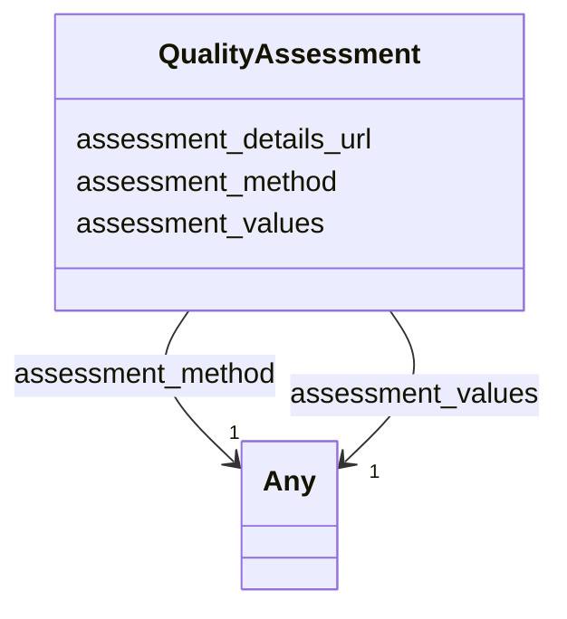

# Class: QualityAssessment 


_Represents the results of a quality assessment that has been carried out on a data file resulting from an experiment or analysis._


URI: [https://w3id.org/fga-wg/schema/top_level/QualityAssessment](https://w3id.org/fga-wg/schema/top_level/QualityAssessment)





<!-- no inheritance hierarchy -->

## Slots

| Name | Cardinality and Range | Description | Inheritance |
| ---  | --- | --- | --- |
| [assessment_method](assessment_method.md) | 1 <br/> [String](String.md)&nbsp;or&nbsp;<br />[Term](Term.md)&nbsp;or&nbsp;<br />[Any](Any.md) | Quality assessment method that has been carried out (e | direct |
| [assessment_values](assessment_values.md) | 1 <br/> [String](String.md)&nbsp;or&nbsp;<br />[AssessmentValue](AssessmentValue.md)&nbsp;or&nbsp;<br />[Any](Any.md) | Main values produced by the quality assessment | direct |
| [assessment_details_url](assessment_details_url.md) | 0..1 <br/> [Uri](Uri.md) | URL to a report containing the detailed output from the quality assessment | direct |


## Usages

| used by | used in | type | used |
| ---  | --- | --- | --- |
| [File](File.md) | [quality_assessments](quality_assessments.md) | range | [QualityAssessment](QualityAssessment.md) |
| [GenomicAnnotationFile](GenomicAnnotationFile.md) | [quality_assessments](quality_assessments.md) | range | [QualityAssessment](QualityAssessment.md) |


## Identifier and Mapping Information


### Schema Source


* from schema: https://w3id.org/fga-wg/schema/top_level


## Mappings

| Mapping Type | Mapped Value |
| ---  | ---  |
| self | https://w3id.org/fga-wg/schema/top_level/QualityAssessment |
| native | https://w3id.org/fga-wg/schema/top_level/QualityAssessment |


## LinkML Source

<!-- TODO: investigate https://stackoverflow.com/questions/37606292/how-to-create-tabbed-code-blocks-in-mkdocs-or-sphinx -->

### Direct

<details>
```yaml
name: QualityAssessment
description: Represents the results of a quality assessment that has been carried
  out on a data file resulting from an experiment or analysis.
from_schema: https://w3id.org/fga-wg/schema/top_level
slots:
- assessment_method
- assessment_values
- assessment_details_url

```
</details>

### Induced

<details>
```yaml
name: QualityAssessment
description: Represents the results of a quality assessment that has been carried
  out on a data file resulting from an experiment or analysis.
from_schema: https://w3id.org/fga-wg/schema/top_level
attributes:
  assessment_method:
    name: assessment_method
    description: Quality assessment method that has been carried out (e.g. BUSCO,
      OMArk, peak calling statistics, etc.)
    examples:
    - value: histone-chipseq-quality-metrics
    from_schema: https://w3id.org/fga-wg/schema/top_level
    rank: 1000
    alias: assessment_method
    owner: QualityAssessment
    domain_of:
    - QualityAssessment
    range: Any
    required: true
    any_of:
    - range: string
    - range: Term
  assessment_values:
    name: assessment_values
    description: Main values produced by the quality assessment.
    examples:
    - object:
        nreads: 21018235
        nreads_in_peaks: 6161851
        frip: 0.2931669095906483
    from_schema: https://w3id.org/fga-wg/schema/top_level
    rank: 1000
    alias: assessment_values
    owner: QualityAssessment
    domain_of:
    - QualityAssessment
    range: Any
    required: true
    any_of:
    - range: string
    - range: AssessmentValue
      multivalued: true
  assessment_details_url:
    name: assessment_details_url
    description: URL to a report containing the detailed output from the quality assessment.
    examples:
    - value: https://www.encodeproject.org/histone-chipseq-quality-metrics/70ae08dc-3edc-437f-a0a5-378c72e6269b/
    from_schema: https://w3id.org/fga-wg/schema/top_level
    rank: 1000
    alias: assessment_details_url
    owner: QualityAssessment
    domain_of:
    - QualityAssessment
    range: uri

```
</details>