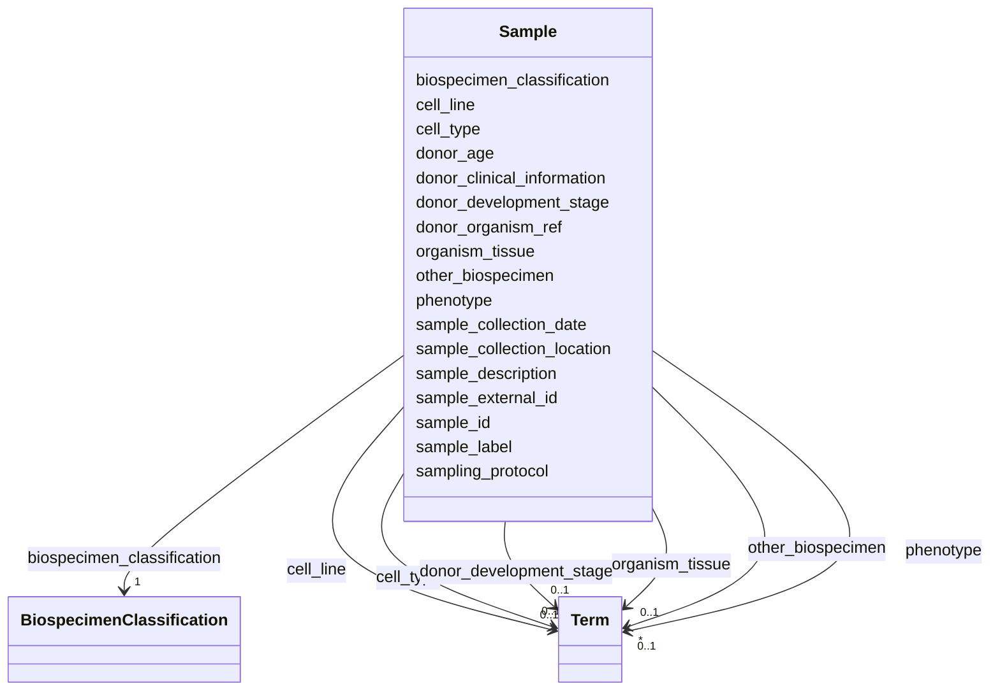

---
search:
  boost: 10.0
---

# Class: Sample 


_Information about a biospecimen/sample used as raw material for lab experiments._


<div data-search-exclude markdown="1">


URI: [https://w3id.org/fga-wg/schema/bundle/Sample](https://w3id.org/fga-wg/schema/bundle/Sample)





## Example

<details>
<summary>Example JSON</summary>

```json
{
  "biospecimen_classification": "cell line",
  "cell_line": {
    "id": "CLO:0034832",
    "label": "AG04450 cell"
  },
  "donor_age": "W12",
  "donor_clinical_information": "apparently healthy",
  "donor_development_stage": {
    "id": "UBERON:0000323",
    "label": "late embryo"
  },
  "donor_organism_ref": "donor:ENCDO001AAA",
  "organism_tissue": {
    "id": "UBERON:0002048",
    "label": "lung"
  },
  "other_biospecimen": [
    {
      "id": "UBERON:0002384",
      "label": "connective tissue"
    },
    {
      "id": "CL:0002320",
      "label": "connective tissue cell"
    },
    {
      "id": "CL:0000057",
      "label": "fibroblast"
    },
    {
      "id": "UBERON:0000925",
      "label": "endoterm"
    },
    {
      "id": "UBERON:0001004",
      "label": "respiratory system"
    }
  ],
  "phenotype": {
    "id": "PATO:0000461",
    "label": "normal"
  },
  "sample_description": "Homo sapiens AG04450 cell line",
  "sample_external_id": "encode:ENCBS004ENC",
  "sample_id": "sample:ENCBS004ENC",
  "sample_label": "Homo sapiens AG04450 cell line",
  "sampling_protocol": "https://www.encodeproject.org/documents/3ed29dac-da67-47be-91b0-c9cad6a1b791/@@download/attachment/AG04450_Stam_protocol.pdf"
}
```
</details>


<!-- no inheritance hierarchy -->

## Slots

| Name | Cardinality and Range | Description | Inheritance |
| ---  | --- | --- | --- |
| [sample_external_id](sample_external_id.md) | 1 <br/> [Curie](Curie.md) | External, globally unique identifier for the biospecimen/sample. | direct |
| [sample_id](sample_id.md) | 1 <br/> [Curie](Curie.md) | Internal identifier for the biospecimen/sample (unique within the metadata deposit). | direct |
| [sample_label](sample_label.md) | 1 <br/> [String](String.md) | A human-readable description of the sample, short enough to be used for listings within software user interfaces, tables, illustration legends, etc. | direct |
| [sample_description](sample_description.md) | 0..1 <br/> [String](String.md) | Human-readable description of the biospecimen/sample and the sampling process. | direct |
| [donor_organism_ref](donor_organism_ref.md) | 1 <br/> [Curie](Curie.md) | Internal reference to the donor/organism from which the biospecimen/sample was taken. | direct |
| [biospecimen_classification](biospecimen_classification.md) | 1 <br/> [BiospecimenClassification](BiospecimenClassification.md) | Main type of structural unit to be used for classification of the biospecimen/sample. | direct |
| [organism_tissue](organism_tissue.md) | 0..1 <br/> [Term](Term.md) | Part of organism (typically tissue or organ) from which the biospecimen/sample was taken, or cell line was derived from. | direct |
| [cell_type](cell_type.md) | 0..1 <br/> [Term](Term.md) | Cell type of isolated normal cells in the biospecimen/sample. | direct |
| [cell_line](cell_line.md) | 0..1 <br/> [Term](Term.md) | Cultured cell line used in the biospecimen/sample. | direct |
| [other_biospecimen](other_biospecimen.md) | * <br/> [Term](Term.md) | Other biospecimen-related terms that can be used to further classify the biospecimen/sample. | direct |
| [sampling_protocol](sampling_protocol.md) | 0..1 <br/> [Uri](Uri.md) | Protocol detailing the collection and treatment of the biospecimen/sample. | direct |
| [sample_collection_location](sample_collection_location.md) | 0..1 <br/> [String](String.md) | Geographical location where the sample was collected. | direct |
| [sample_collection_date](sample_collection_date.md) | 0..1 <br/> [Datetime](Datetime.md) | Date of sample collection. | direct |
| [phenotype](phenotype.md) | 0..1 <br/> [Term](Term.md) | Main phenotype (e.g. disease) connected to the biospecimen/sample. | direct |
| [donor_age](donor_age.md) | 0..1 <br/> [String](String.md) | Age of the donor/organism at the time of sampling | direct |
| [donor_development_stage](donor_development_stage.md) | 0..1 <br/> [Term](Term.md) | Development stage of the donor at the time of sampling. | direct |
| [donor_clinical_information](donor_clinical_information.md) | 0..1 <br/> [String](String.md) | Clinical information of the donor/organism at the time of sampling. | direct |


## Usages

| used by | used in | type | used |
| ---  | --- | --- | --- |
| [Bundle](Bundle.md) | [samples](samples.md) | range | [Sample](Sample.md) |


## Rules


### 

| Rule Applied | Preconditions | Postconditions | Elseconditions |
|--------------|---------------|----------------|----------------|
| slot_conditions |```{'biospecimen_classification': {'equals_string': 'cell line'}}``` |```{'cell_line': {'required': True}}``` | |


### 

| Rule Applied | Preconditions | Postconditions | Elseconditions |
|--------------|---------------|----------------|----------------|
| any_of |```[{'slot_conditions': {'biospecimen_classification': {'equals_string': 'in vitro differentiated cells'}}}, {'slot_conditions': {'biospecimen_classification': {'equals_string': 'primary cell'}}}]``` | | |


### 

| Rule Applied | Preconditions | Postconditions | Elseconditions |
|--------------|---------------|----------------|----------------|
| any_of |```[{'slot_conditions': {'biospecimen_classification': {'equals_string': 'tissue'}}}, {'slot_conditions': {'biospecimen_classification': {'equals_string': 'organoid'}}}]``` | | |


## Identifier and Mapping Information


### Schema Source


* from schema: https://w3id.org/fga-wg/schema/bundle


## Mappings

| Mapping Type | Mapped Value |
| ---  | ---  |
| self | https://w3id.org/fga-wg/schema/bundle/Sample |
| native | https://w3id.org/fga-wg/schema/bundle/Sample |


## LinkML Source

<!-- TODO: investigate https://stackoverflow.com/questions/37606292/how-to-create-tabbed-code-blocks-in-mkdocs-or-sphinx -->

### Direct

<details>
```yaml
name: Sample
description: Information about a biospecimen/sample used as raw material for lab experiments.
from_schema: https://w3id.org/fga-wg/schema/bundle
slots:
- sample_external_id
- sample_id
- sample_label
- sample_description
- donor_organism_ref
- biospecimen_classification
- organism_tissue
- cell_type
- cell_line
- other_biospecimen
- sampling_protocol
- sample_collection_location
- sample_collection_date
- phenotype
- donor_age
- donor_development_stage
- donor_clinical_information
rules:
- preconditions:
    slot_conditions:
      biospecimen_classification:
        name: biospecimen_classification
        equals_string: cell line
  postconditions:
    slot_conditions:
      cell_line:
        name: cell_line
        required: true
- preconditions:
    any_of:
    - slot_conditions:
        biospecimen_classification:
          name: biospecimen_classification
          equals_string: in vitro differentiated cells
    - slot_conditions:
        biospecimen_classification:
          name: biospecimen_classification
          equals_string: primary cell
  postconditions:
    slot_conditions:
      cell_type:
        name: cell_type
        required: true
- preconditions:
    any_of:
    - slot_conditions:
        biospecimen_classification:
          name: biospecimen_classification
          equals_string: tissue
    - slot_conditions:
        biospecimen_classification:
          name: biospecimen_classification
          equals_string: organoid
  postconditions:
    slot_conditions:
      organism_tissue:
        name: organism_tissue
        required: true

```
</details>

### Induced

<details>
```yaml
name: Sample
description: Information about a biospecimen/sample used as raw material for lab experiments.
from_schema: https://w3id.org/fga-wg/schema/bundle
attributes:
  sample_external_id:
    name: sample_external_id
    description: External, globally unique identifier for the biospecimen/sample.
    examples:
    - value: encode:ENCBS004ENC
    from_schema: https://w3id.org/fga-wg/schema/bundle
    rank: 1000
    owner: Sample
    domain_of:
    - Sample
    range: curie
    required: true
  sample_id:
    name: sample_id
    description: Internal identifier for the biospecimen/sample (unique within the
      metadata deposit).
    examples:
    - value: sample:ENCBS004ENC
    from_schema: https://w3id.org/fga-wg/schema/bundle
    rank: 1000
    identifier: true
    owner: Sample
    domain_of:
    - Sample
    range: curie
    required: true
  sample_label:
    name: sample_label
    description: A human-readable description of the sample, short enough to be used
      for listings within software user interfaces, tables, illustration legends,
      etc.
    examples:
    - value: Homo sapiens AG04450 cell line
    from_schema: https://w3id.org/fga-wg/schema/bundle
    rank: 1000
    owner: Sample
    domain_of:
    - Sample
    range: string
    required: true
    pattern: ^.{1,60}$
  sample_description:
    name: sample_description
    description: Human-readable description of the biospecimen/sample and the sampling
      process.
    examples:
    - value: Homo sapiens AG04450 cell line
    from_schema: https://w3id.org/fga-wg/schema/bundle
    rank: 1000
    owner: Sample
    domain_of:
    - Sample
    range: string
  donor_organism_ref:
    name: donor_organism_ref
    description: Internal reference to the donor/organism from which the biospecimen/sample
      was taken.
    examples:
    - value: donor:ENCDO001AAA
    from_schema: https://w3id.org/fga-wg/schema/bundle
    rank: 1000
    owner: Sample
    domain_of:
    - Sample
    range: curie
    required: true
  biospecimen_classification:
    name: biospecimen_classification
    description: Main type of structural unit to be used for classification of the
      biospecimen/sample.
    examples:
    - value: cell line
    from_schema: https://w3id.org/fga-wg/schema/bundle
    rank: 1000
    owner: Sample
    domain_of:
    - Sample
    range: BiospecimenClassification
    required: true
  organism_tissue:
    name: organism_tissue
    description: Part of organism (typically tissue or organ) from which the biospecimen/sample
      was taken, or cell line was derived from.
    examples:
    - object:
        id: UBERON:0002048
        label: lung
    from_schema: https://w3id.org/fga-wg/schema/bundle
    rank: 1000
    owner: Sample
    domain_of:
    - Sample
    range: Term
  cell_type:
    name: cell_type
    description: Cell type of isolated normal cells in the biospecimen/sample.
    from_schema: https://w3id.org/fga-wg/schema/bundle
    rank: 1000
    owner: Sample
    domain_of:
    - Sample
    range: Term
  cell_line:
    name: cell_line
    description: Cultured cell line used in the biospecimen/sample.
    examples:
    - object:
        id: CLO:0034832
        label: AG04450 cell
    from_schema: https://w3id.org/fga-wg/schema/bundle
    rank: 1000
    owner: Sample
    domain_of:
    - Sample
    range: Term
  other_biospecimen:
    name: other_biospecimen
    description: Other biospecimen-related terms that can be used to further classify
      the biospecimen/sample.
    examples:
    - object:
        id: UBERON:0002384
        label: connective tissue
    - object:
        id: CL:0002320
        label: connective tissue cell
    - object:
        id: CL:0000057
        label: fibroblast
    - object:
        id: UBERON:0000925
        label: endoterm
    - object:
        id: UBERON:0001004
        label: respiratory system
    from_schema: https://w3id.org/fga-wg/schema/bundle
    rank: 1000
    owner: Sample
    domain_of:
    - Sample
    range: Term
    multivalued: true
  sampling_protocol:
    name: sampling_protocol
    description: Protocol detailing the collection and treatment of the biospecimen/sample.
    examples:
    - value: https://www.encodeproject.org/documents/3ed29dac-da67-47be-91b0-c9cad6a1b791/@@download/attachment/AG04450_Stam_protocol.pdf
    from_schema: https://w3id.org/fga-wg/schema/bundle
    rank: 1000
    owner: Sample
    domain_of:
    - Sample
    range: uri
  sample_collection_location:
    name: sample_collection_location
    description: Geographical location where the sample was collected.
    from_schema: https://w3id.org/fga-wg/schema/bundle
    rank: 1000
    owner: Sample
    domain_of:
    - Sample
    range: string
  sample_collection_date:
    name: sample_collection_date
    description: Date of sample collection.
    from_schema: https://w3id.org/fga-wg/schema/bundle
    rank: 1000
    owner: Sample
    domain_of:
    - Sample
    range: datetime
  phenotype:
    name: phenotype
    description: Main phenotype (e.g. disease) connected to the biospecimen/sample.
    examples:
    - object:
        id: PATO:0000461
        label: normal
    from_schema: https://w3id.org/fga-wg/schema/bundle
    rank: 1000
    owner: Sample
    domain_of:
    - Sample
    range: Term
  donor_age:
    name: donor_age
    description: Age of the donor/organism at the time of sampling
    examples:
    - value: W12
    from_schema: https://w3id.org/fga-wg/schema/bundle
    rank: 1000
    owner: Sample
    domain_of:
    - Sample
    range: string
  donor_development_stage:
    name: donor_development_stage
    description: Development stage of the donor at the time of sampling.
    examples:
    - object:
        id: UBERON:0000323
        label: late embryo
    from_schema: https://w3id.org/fga-wg/schema/bundle
    rank: 1000
    owner: Sample
    domain_of:
    - Sample
    range: Term
  donor_clinical_information:
    name: donor_clinical_information
    description: Clinical information of the donor/organism at the time of sampling.
    examples:
    - value: apparently healthy
    from_schema: https://w3id.org/fga-wg/schema/bundle
    rank: 1000
    owner: Sample
    domain_of:
    - Sample
    range: string
rules:
- preconditions:
    slot_conditions:
      biospecimen_classification:
        name: biospecimen_classification
        equals_string: cell line
  postconditions:
    slot_conditions:
      cell_line:
        name: cell_line
        required: true
- preconditions:
    any_of:
    - slot_conditions:
        biospecimen_classification:
          name: biospecimen_classification
          equals_string: in vitro differentiated cells
    - slot_conditions:
        biospecimen_classification:
          name: biospecimen_classification
          equals_string: primary cell
  postconditions:
    slot_conditions:
      cell_type:
        name: cell_type
        required: true
- preconditions:
    any_of:
    - slot_conditions:
        biospecimen_classification:
          name: biospecimen_classification
          equals_string: tissue
    - slot_conditions:
        biospecimen_classification:
          name: biospecimen_classification
          equals_string: organoid
  postconditions:
    slot_conditions:
      organism_tissue:
        name: organism_tissue
        required: true

```
</details></div>