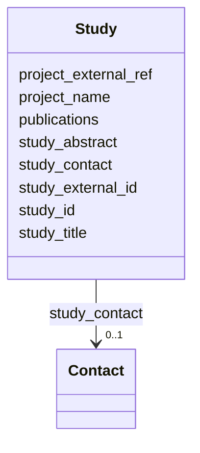

---
search:
  boost: 10.0
---

# Class: Study 


_A scientific study, i.e. a unit of research, within which experiments and/or analyses have been carried out._


<div data-search-exclude markdown="1">


URI: [https://w3id.org/fga-wg/schema/bundle/Study](https://w3id.org/fga-wg/schema/bundle/Study)





## Example

<details>
<summary>Example JSON</summary>

```json
{
  "project_external_ref": "bioproject:PRJNA63441",
  "publications": [
    "https://doi.org/10.1038/s41467-020-14743-w"
  ],
  "study_abstract": "ENCODE comprises thousands of functional genomics datasets, and the encyclopedia covers hundreds of cell types, providing a universal annotation for genome interpretation. However, for particular applications, it may be advantageous to use a customized annotation. Here, we develop such a custom annotation by leveraging advanced assays, such as eCLIP, Hi-C, and whole-genome STARR-seq on a number of data-rich ENCODE cell types. A key aspect of this annotation is comprehensive and experimentally derived networks of both transcription factors and RNA-binding proteins (TFs and RBPs). Cancer, a disease of system-wide dysregulation, is an ideal application for such a network-based annotation. Specifically, for cancer-associated cell types, we put regulators into hierarchies and measure their network change (rewiring) during oncogenesis. We also extensively survey TF-RBP crosstalk, highlighting how SUB1, a previously uncharacterized RBP, drives aberrant tumor expression and amplifies the effect of MYC, a well-known oncogenic TF. Furthermore, we show how our annotation allows us to place oncogenic transformations in the context of a broad cell space; here, many normal-to-tumor transitions move towards a stem-like state, while oncogene knockdowns show an opposing trend. Finally, we organize the resource into a coherent workflow to prioritize key elements and variants, in addition to regulators. We showcase the application of this prioritization to somatic burdening, cancer differential expression and GWAS. Targeted validations of the prioritized regulators, elements and variants using siRNA knockdowns, CRISPR-based editing, and luciferase assays demonstrate the value of the ENCODE resource.",
  "study_contact": {
    "contact_id": "orcid:0000-0002-9746-3719",
    "email": "mark@gersteinlab.org",
    "name": "Mark Gerstein"
  },
  "study_external_id": "biostudies:S-EPMC7391744",
  "study_id": "study:S-EPMC7391744",
  "study_title": "An integrative ENCODE resource for cancer genomics"
}
```
</details>


<!-- no inheritance hierarchy -->

## Slots

| Name | Cardinality and Range | Description | Inheritance |
| ---  | --- | --- | --- |
| [study_external_id](study_external_id.md) | 0..1 <br/> [Curie](Curie.md) | External, globally unique identifier for the study (preferably a BioStudies CURIE). | direct |
| [study_id](study_id.md) | 1 <br/> [Curie](Curie.md) | Internal identifier for the study (unique within the metadata deposit). Namespace: "study". | direct |
| [study_title](study_title.md) | 1 <br/> [String](String.md) | Title of the study. | direct |
| [study_abstract](study_abstract.md) | 0..1 <br/> [String](String.md) | Abstract of the study. | direct |
| [project_external_ref](project_external_ref.md) | 0..1 <br/> [Uriorcurie](Uriorcurie.md) | Reference to a project within which the study was carried out (preferably a BioProject CURIE). | direct |
| [project_name](project_name.md) | 0..1 <br/> [String](String.md) | Name of the project within which the study was carried out. | direct |
| [publications](publications.md) | * <br/> [Curie](Curie.md) | List of (relevant) publications containing the results of the study (in the form of DOI CURIEs). | direct |
| [study_contact](study_contact.md) | 0..1 <br/> [Contact](Contact.md) | Contact point for the study. | direct |


## Usages

| used by | used in | type | used |
| ---  | --- | --- | --- |
| [Bundle](Bundle.md) | [studies](studies.md) | range | [Study](Study.md) |


## Identifier and Mapping Information


### Schema Source


* from schema: https://w3id.org/fga-wg/schema/bundle


## Mappings

| Mapping Type | Mapped Value |
| ---  | ---  |
| self | https://w3id.org/fga-wg/schema/bundle/Study |
| native | https://w3id.org/fga-wg/schema/bundle/Study |


## LinkML Source

<!-- TODO: investigate https://stackoverflow.com/questions/37606292/how-to-create-tabbed-code-blocks-in-mkdocs-or-sphinx -->

### Direct

<details>
```yaml
name: Study
description: A scientific study, i.e. a unit of research, within which experiments
  and/or analyses have been carried out.
from_schema: https://w3id.org/fga-wg/schema/bundle
slots:
- study_external_id
- study_id
- study_title
- study_abstract
- project_external_ref
- project_name
- publications
- study_contact

```
</details>

### Induced

<details>
```yaml
name: Study
description: A scientific study, i.e. a unit of research, within which experiments
  and/or analyses have been carried out.
from_schema: https://w3id.org/fga-wg/schema/bundle
attributes:
  study_external_id:
    name: study_external_id
    description: External, globally unique identifier for the study (preferably a
      BioStudies CURIE).
    examples:
    - value: biostudies:S-EPMC7391744
    from_schema: https://w3id.org/fga-wg/schema/bundle
    rank: 1000
    owner: Study
    domain_of:
    - Study
    range: curie
  study_id:
    name: study_id
    description: 'Internal identifier for the study (unique within the metadata deposit).
      Namespace: "study".'
    examples:
    - value: study:S-EPMC7391744
    from_schema: https://w3id.org/fga-wg/schema/bundle
    rank: 1000
    identifier: true
    owner: Study
    domain_of:
    - Study
    range: curie
    required: true
  study_title:
    name: study_title
    description: Title of the study.
    examples:
    - value: An integrative ENCODE resource for cancer genomics
    from_schema: https://w3id.org/fga-wg/schema/bundle
    rank: 1000
    owner: Study
    domain_of:
    - Study
    range: string
    required: true
  study_abstract:
    name: study_abstract
    description: Abstract of the study.
    examples:
    - value: ENCODE comprises thousands of functional genomics datasets, and the encyclopedia
        covers hundreds of cell types, providing a universal annotation for genome
        interpretation. However, for particular applications, it may be advantageous
        to use a customized annotation. Here, we develop such a custom annotation
        by leveraging advanced assays, such as eCLIP, Hi-C, and whole-genome STARR-seq
        on a number of data-rich ENCODE cell types. A key aspect of this annotation
        is comprehensive and experimentally derived networks of both transcription
        factors and RNA-binding proteins (TFs and RBPs). Cancer, a disease of system-wide
        dysregulation, is an ideal application for such a network-based annotation.
        Specifically, for cancer-associated cell types, we put regulators into hierarchies
        and measure their network change (rewiring) during oncogenesis. We also extensively
        survey TF-RBP crosstalk, highlighting how SUB1, a previously uncharacterized
        RBP, drives aberrant tumor expression and amplifies the effect of MYC, a well-known
        oncogenic TF. Furthermore, we show how our annotation allows us to place oncogenic
        transformations in the context of a broad cell space; here, many normal-to-tumor
        transitions move towards a stem-like state, while oncogene knockdowns show
        an opposing trend. Finally, we organize the resource into a coherent workflow
        to prioritize key elements and variants, in addition to regulators. We showcase
        the application of this prioritization to somatic burdening, cancer differential
        expression and GWAS. Targeted validations of the prioritized regulators, elements
        and variants using siRNA knockdowns, CRISPR-based editing, and luciferase
        assays demonstrate the value of the ENCODE resource.
    from_schema: https://w3id.org/fga-wg/schema/bundle
    rank: 1000
    owner: Study
    domain_of:
    - Study
    range: string
  project_external_ref:
    name: project_external_ref
    description: Reference to a project within which the study was carried out (preferably
      a BioProject CURIE).
    examples:
    - value: bioproject:PRJNA63441
    from_schema: https://w3id.org/fga-wg/schema/bundle
    rank: 1000
    owner: Study
    domain_of:
    - Study
    range: uriorcurie
  project_name:
    name: project_name
    description: Name of the project within which the study was carried out.
    from_schema: https://w3id.org/fga-wg/schema/bundle
    rank: 1000
    owner: Study
    domain_of:
    - Study
    range: string
  publications:
    name: publications
    description: List of (relevant) publications containing the results of the study
      (in the form of DOI CURIEs).
    examples:
    - value: https://doi.org/10.1038/s41467-020-14743-w
    from_schema: https://w3id.org/fga-wg/schema/bundle
    rank: 1000
    owner: Study
    domain_of:
    - Study
    range: curie
    multivalued: true
  study_contact:
    name: study_contact
    description: Contact point for the study.
    examples:
    - object:
        name: Mark Gerstein
        contact_id: orcid:0000-0002-9746-3719
        email: mark@gersteinlab.org
    from_schema: https://w3id.org/fga-wg/schema/bundle
    rank: 1000
    owner: Study
    domain_of:
    - Study
    range: Contact

```
</details></div>