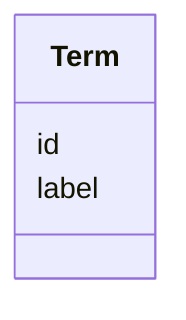

# Class: Term 


_Helper entity to represent an ontology term as a data value. _


URI: [https://w3id.org/fga-wg/schema/top_level/Term](https://w3id.org/fga-wg/schema/top_level/Term)





<!-- no inheritance hierarchy -->

## Slots

| Name | Cardinality and Range | Description | Inheritance |
| ---  | --- | --- | --- |
| [id](id.md) | 1 <br/> [Curie](Curie.md) | External, globally unique identifier for the ontology term (in CURIE form) | direct |
| [label](label.md) | 0..1 <br/> [String](String.md) | Human-readable label associated to the term id in the current version of the ... | direct |


## Usages

| used by | used in | type | used |
| ---  | --- | --- | --- |
| [InputSource](InputSource.md) | [qualified_relation](qualified_relation.md) | range | [Term](Term.md) |
| [Analysis](Analysis.md) | [analysis_type](analysis_type.md) | range | [Term](Term.md) |
| [Donor](Donor.md) | [species_taxon](species_taxon.md) | range | [Term](Term.md) |
| [Donor](Donor.md) | [sex](sex.md) | range | [Term](Term.md) |
| [Experiment](Experiment.md) | [molecule_type](molecule_type.md) | range | [Term](Term.md) |
| [Experiment](Experiment.md) | [assay_type](assay_type.md) | range | [Term](Term.md) |
| [Experiment](Experiment.md) | [library_layout](library_layout.md) | range | [Term](Term.md) |
| [Experiment](Experiment.md) | [instrument](instrument.md) | range | [Term](Term.md) |
| [Experiment](Experiment.md) | [antibody_target](antibody_target.md) | range | [Term](Term.md) |
| [Experiment](Experiment.md) | [biological_processes](biological_processes.md) | range | [Term](Term.md) |
| [File](File.md) | [file_type](file_type.md) | range | [Term](Term.md) |
| [QualityAssessment](QualityAssessment.md) | [assessment_method](assessment_method.md) | any_of[range] | [Term](Term.md) |
| [GenomicAnnotationFile](GenomicAnnotationFile.md) | [sequence_features](sequence_features.md) | range | [Term](Term.md) |
| [GenomicAnnotationFile](GenomicAnnotationFile.md) | [file_type](file_type.md) | range | [Term](Term.md) |
| [Sample](Sample.md) | [organism_tissue](organism_tissue.md) | range | [Term](Term.md) |
| [Sample](Sample.md) | [cell_type](cell_type.md) | range | [Term](Term.md) |
| [Sample](Sample.md) | [cell_line](cell_line.md) | range | [Term](Term.md) |
| [Sample](Sample.md) | [other_biospecimen](other_biospecimen.md) | range | [Term](Term.md) |
| [Sample](Sample.md) | [phenotype](phenotype.md) | range | [Term](Term.md) |
| [Sample](Sample.md) | [donor_development_stage](donor_development_stage.md) | range | [Term](Term.md) |


## Identifier and Mapping Information


### Schema Source


* from schema: https://w3id.org/fga-wg/schema/top_level


## Mappings

| Mapping Type | Mapped Value |
| ---  | ---  |
| self | https://w3id.org/fga-wg/schema/top_level/Term |
| native | https://w3id.org/fga-wg/schema/top_level/Term |


## LinkML Source

<!-- TODO: investigate https://stackoverflow.com/questions/37606292/how-to-create-tabbed-code-blocks-in-mkdocs-or-sphinx -->

### Direct

<details>
```yaml
name: Term
description: 'Helper entity to represent an ontology term as a data value. '
from_schema: https://w3id.org/fga-wg/schema/top_level
slots:
- id
- label

```
</details>

### Induced

<details>
```yaml
name: Term
description: 'Helper entity to represent an ontology term as a data value. '
from_schema: https://w3id.org/fga-wg/schema/top_level
attributes:
  id:
    name: id
    description: External, globally unique identifier for the ontology term (in CURIE
      form).
    examples:
    - value: obi:OBI_0000716
    from_schema: https://w3id.org/fga-wg/schema/top_level
    rank: 1000
    alias: id
    owner: Term
    domain_of:
    - Term
    range: curie
    required: true
  label:
    name: label
    description: Human-readable label associated to the term id in the current version
      of the ontology (as listed in the "ontology_versions" field of the Deposit object).
    examples:
    - value: ChIP-seq assay
    from_schema: https://w3id.org/fga-wg/schema/top_level
    rank: 1000
    alias: label
    owner: Term
    domain_of:
    - Term
    range: string

```
</details>