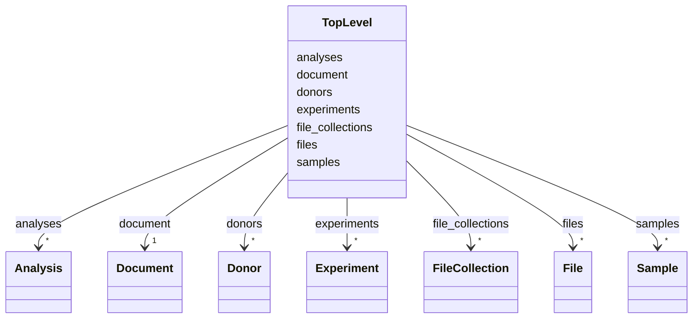

---
search:
  boost: 10.0
---

# Class: TopLevel 


_A document of harmonised metadata for a set of genome annotation files. Metadata has been harmonised in line with the "FAIRification of Genomic Annotations" data model. This is the top-level class to be used as root for the metadata document._


<div data-search-exclude markdown="1">


URI: [https://w3id.org/fga-wg/schema/top_level/TopLevel](https://w3id.org/fga-wg/schema/top_level/TopLevel)





<!-- no inheritance hierarchy -->

## Slots

| Name | Cardinality and Range | Description | Inheritance |
| ---  | --- | --- | --- |
| [document](document.md) | 1 <br/> [Document](Document.md) | Information about this document containing harmonised metadata about a set of... | direct |
| [file_collections](file_collections.md) | * <br/> [FileCollection](FileCollection.md) | Information about collections of files contained in this dataset, each collec... | direct |
| [files](files.md) | * <br/> [File](File.md) | Information about particular genome annotation (and other relevant) files | direct |
| [experiments](experiments.md) | * <br/> [Experiment](Experiment.md) | Information about sequencing experiments that have been carried out to genera... | direct |
| [analyses](analyses.md) | * <br/> [Analysis](Analysis.md) | Information about computational processing and analyses that have been carrie... | direct |
| [samples](samples.md) | * <br/> [Sample](Sample.md) | Information about the biospecimens/samples used as raw material for lab exper... | direct |
| [donors](donors.md) | * <br/> [Donor](Donor.md) | Information about the donors or complete organisms from which the samples wer... | direct |


## Identifier and Mapping Information


### Schema Source


* from schema: https://w3id.org/fga-wg/schema/top_level


## Mappings

| Mapping Type | Mapped Value |
| ---  | ---  |
| self | https://w3id.org/fga-wg/schema/top_level/TopLevel |
| native | https://w3id.org/fga-wg/schema/top_level/TopLevel |


## LinkML Source

<!-- TODO: investigate https://stackoverflow.com/questions/37606292/how-to-create-tabbed-code-blocks-in-mkdocs-or-sphinx -->

### Direct

<details>
```yaml
name: TopLevel
description: A document of harmonised metadata for a set of genome annotation files.
  Metadata has been harmonised in line with the "FAIRification of Genomic Annotations"
  data model. This is the top-level class to be used as root for the metadata document.
from_schema: https://w3id.org/fga-wg/schema/top_level
slots:
- document
- file_collections
- files
- experiments
- analyses
- samples
- donors

```
</details>

### Induced

<details>
```yaml
name: TopLevel
description: A document of harmonised metadata for a set of genome annotation files.
  Metadata has been harmonised in line with the "FAIRification of Genomic Annotations"
  data model. This is the top-level class to be used as root for the metadata document.
from_schema: https://w3id.org/fga-wg/schema/top_level
attributes:
  document:
    name: document
    description: Information about this document containing harmonised metadata about
      a set of genome annotation files. This includes self-referential identifiers
      and versioning of public deposits of the document.
    from_schema: https://w3id.org/fga-wg/schema/top_level
    rank: 1000
    owner: TopLevel
    domain_of:
    - TopLevel
    range: Document
    required: true
    inlined: true
  file_collections:
    name: file_collections
    description: Information about collections of files contained in this dataset,
      each collection defined according to some selection criteria.
    from_schema: https://w3id.org/fga-wg/schema/top_level
    rank: 1000
    owner: TopLevel
    domain_of:
    - TopLevel
    range: FileCollection
    multivalued: true
    inlined: true
    inlined_as_list: true
  files:
    name: files
    description: Information about particular genome annotation (and other relevant)
      files.
    from_schema: https://w3id.org/fga-wg/schema/top_level
    rank: 1000
    owner: TopLevel
    domain_of:
    - TopLevel
    range: File
    multivalued: true
    inlined: true
    inlined_as_list: true
  experiments:
    name: experiments
    description: Information about sequencing experiments that have been carried out
      to generate the files.
    from_schema: https://w3id.org/fga-wg/schema/top_level
    rank: 1000
    owner: TopLevel
    domain_of:
    - TopLevel
    range: Experiment
    multivalued: true
    inlined: true
    inlined_as_list: true
  analyses:
    name: analyses
    description: Information about computational processing and analyses that have
      been carried out to generate the files.
    from_schema: https://w3id.org/fga-wg/schema/top_level
    rank: 1000
    owner: TopLevel
    domain_of:
    - TopLevel
    range: Analysis
    multivalued: true
    inlined: true
    inlined_as_list: true
  samples:
    name: samples
    description: Information about the biospecimens/samples used as raw material for
      lab experiments.
    from_schema: https://w3id.org/fga-wg/schema/top_level
    rank: 1000
    owner: TopLevel
    domain_of:
    - TopLevel
    range: Sample
    multivalued: true
    inlined: true
    inlined_as_list: true
  donors:
    name: donors
    description: Information about the donors or complete organisms from which the
      samples were taken.
    from_schema: https://w3id.org/fga-wg/schema/top_level
    rank: 1000
    owner: TopLevel
    domain_of:
    - TopLevel
    range: Donor
    multivalued: true
    inlined: true
    inlined_as_list: true

```
</details></div>