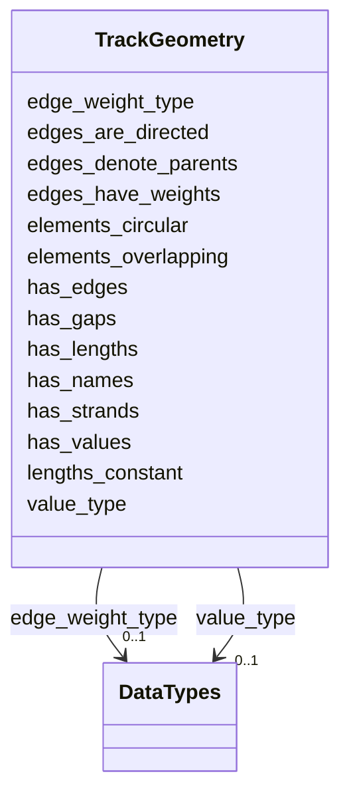

---
search:
  boost: 10.0
---

# Class: TrackGeometry 


_Overall geometric properties of the sequence features in the genomic annotation file if considered as an one-dimensional genome browser track, in line with the track type delineations from Gundersen et. al, 2011. While conceptually based on visual characteristics, these properties are also useful to e.g. select relevant annotation files for non-visual analyses._


<div data-search-exclude markdown="1">


URI: [https://w3id.org/fga-wg/schema/top_level/TrackGeometry](https://w3id.org/fga-wg/schema/top_level/TrackGeometry)





## Example

<details>
<summary>Example JSON</summary>

```json
{
  "elements_circular": false,
  "elements_overlapping": false,
  "has_edges": false,
  "has_gaps": true,
  "has_lengths": true,
  "has_names": true,
  "has_strands": false,
  "has_values": true,
  "lengths_constant": false,
  "value_type": "multiple"
}
```
</details>


<!-- no inheritance hierarchy -->

## Slots

| Name | Cardinality and Range | Description | Inheritance |
| ---  | --- | --- | --- |
| [has_gaps](has_gaps.md) | 1 <br/> [Boolean](Boolean.md) | Whether there are gaps between the sequence features (there exists at least o... | direct |
| [has_lengths](has_lengths.md) | 1 <br/> [Boolean](Boolean.md) | Whether the sequence features have lengths (at least one feature spans more t... | direct |
| [has_strands](has_strands.md) | 1 <br/> [Boolean](Boolean.md) | Whether the sequence features are stranded (at least one feature has strand i... | direct |
| [has_values](has_values.md) | 1 <br/> [Boolean](Boolean.md) | Whether the sequence features have associated values (at least one feature ha... | direct |
| [has_edges](has_edges.md) | 1 <br/> [Boolean](Boolean.md) | Whether the sequence features are linked across positions (at least one edge ... | direct |
| [has_names](has_names.md) | 1 <br/> [Boolean](Boolean.md) | Whether the sequence features are named (at least one feature has a name) | direct |
| [elements_overlapping](elements_overlapping.md) | 1 <br/> [Boolean](Boolean.md) | Whether the sequence features are overlapping (at least one base pair is simu... | direct |
| [elements_circular](elements_circular.md) | 1 <br/> [Boolean](Boolean.md) | Whether the sequence features have circular coordinates (at least one feature... | direct |
| [lengths_constant](lengths_constant.md) | 0..1 <br/> [Boolean](Boolean.md) | Whether the sequence lengths are constant (all sequence features have the sam... | direct |
| [value_type](value_type.md) | 0..1 <br/> [DataTypes](DataTypes.md) | The type of values associated with the sequence features, if any | direct |
| [edges_have_weights](edges_have_weights.md) | 0..1 <br/> [Boolean](Boolean.md) | Whether the edges linking sequence features are weighted (at least one edge b... | direct |
| [edge_weight_type](edge_weight_type.md) | 0..1 <br/> [DataTypes](DataTypes.md) | The type of values associated with the edges | direct |
| [edges_are_directed](edges_are_directed.md) | 0..1 <br/> [Boolean](Boolean.md) | Whether the edges linking sequence features are directed (at least one edge b... | direct |
| [edges_denote_parents](edges_denote_parents.md) | 0..1 <br/> [Boolean](Boolean.md) | Whether the edges linking sequence features denote a parent-child relationshi... | direct |


## Usages

| used by | used in | type | used |
| ---  | --- | --- | --- |
| [GenomicAnnotationFile](GenomicAnnotationFile.md) | [track_geometry](track_geometry.md) | range | [TrackGeometry](TrackGeometry.md) |


## Rules


### 

| Rule Applied | Preconditions | Postconditions | Elseconditions |
|--------------|---------------|----------------|----------------|
| slot_conditions |```{'has_lengths': {'equals_number': True}}``` |```{'lengths_constant': {'required': True}}``` | |


### 

| Rule Applied | Preconditions | Postconditions | Elseconditions |
|--------------|---------------|----------------|----------------|
| slot_conditions |```{'has_values': {'equals_number': True}}``` |```{'value_type': {'required': True}}``` | |


### 

| Rule Applied | Preconditions | Postconditions | Elseconditions |
|--------------|---------------|----------------|----------------|
| slot_conditions |```{'has_edges': {'equals_number': True}}``` | | |


### 

| Rule Applied | Preconditions | Postconditions | Elseconditions |
|--------------|---------------|----------------|----------------|
| slot_conditions |```{'edges_have_weights': {'equals_number': True}}``` |```{'edge_weight_type': {'required': True}}``` | |


## Identifier and Mapping Information


### Schema Source


* from schema: https://w3id.org/fga-wg/schema/top_level


## Mappings

| Mapping Type | Mapped Value |
| ---  | ---  |
| self | https://w3id.org/fga-wg/schema/top_level/TrackGeometry |
| native | https://w3id.org/fga-wg/schema/top_level/TrackGeometry |


## LinkML Source

<!-- TODO: investigate https://stackoverflow.com/questions/37606292/how-to-create-tabbed-code-blocks-in-mkdocs-or-sphinx -->

### Direct

<details>
```yaml
name: TrackGeometry
description: Overall geometric properties of the sequence features in the genomic
  annotation file if considered as an one-dimensional genome browser track, in line
  with the track type delineations from Gundersen et. al, 2011. While conceptually
  based on visual characteristics, these properties are also useful to e.g. select
  relevant annotation files for non-visual analyses.
from_schema: https://w3id.org/fga-wg/schema/top_level
slots:
- has_gaps
- has_lengths
- has_strands
- has_values
- has_edges
- has_names
- elements_overlapping
- elements_circular
- lengths_constant
- value_type
- edges_have_weights
- edge_weight_type
- edges_are_directed
- edges_denote_parents
rules:
- preconditions:
    slot_conditions:
      has_lengths:
        name: has_lengths
        equals_number: true
  postconditions:
    slot_conditions:
      lengths_constant:
        name: lengths_constant
        required: true
- preconditions:
    slot_conditions:
      has_values:
        name: has_values
        equals_number: true
  postconditions:
    slot_conditions:
      value_type:
        name: value_type
        required: true
- preconditions:
    slot_conditions:
      has_edges:
        name: has_edges
        equals_number: true
  postconditions:
    all_of:
    - slot_conditions:
        edges_have_weights:
          name: edges_have_weights
          required: true
    - slot_conditions:
        edges_are_directed:
          name: edges_are_directed
          required: true
    - slot_conditions:
        edges_denote_parents:
          name: edges_denote_parents
          required: true
- preconditions:
    slot_conditions:
      edges_have_weights:
        name: edges_have_weights
        equals_number: true
  postconditions:
    slot_conditions:
      edge_weight_type:
        name: edge_weight_type
        required: true

```
</details>

### Induced

<details>
```yaml
name: TrackGeometry
description: Overall geometric properties of the sequence features in the genomic
  annotation file if considered as an one-dimensional genome browser track, in line
  with the track type delineations from Gundersen et. al, 2011. While conceptually
  based on visual characteristics, these properties are also useful to e.g. select
  relevant annotation files for non-visual analyses.
from_schema: https://w3id.org/fga-wg/schema/top_level
attributes:
  has_gaps:
    name: has_gaps
    description: Whether there are gaps between the sequence features (there exists
      at least one gap between two features on the same sequence).
    examples:
    - value: 'True'
    from_schema: https://w3id.org/fga-wg/schema/top_level
    rank: 1000
    owner: TrackGeometry
    domain_of:
    - TrackGeometry
    range: boolean
    required: true
  has_lengths:
    name: has_lengths
    description: Whether the sequence features have lengths (at least one feature
      spans more than 1 base pair).
    examples:
    - value: 'True'
    from_schema: https://w3id.org/fga-wg/schema/top_level
    rank: 1000
    owner: TrackGeometry
    domain_of:
    - TrackGeometry
    range: boolean
    required: true
  has_strands:
    name: has_strands
    description: Whether the sequence features are stranded (at least one feature
      has strand information).
    examples:
    - value: 'False'
    from_schema: https://w3id.org/fga-wg/schema/top_level
    rank: 1000
    owner: TrackGeometry
    domain_of:
    - TrackGeometry
    range: boolean
    required: true
  has_values:
    name: has_values
    description: Whether the sequence features have associated values (at least one
      feature has an associated value).
    examples:
    - value: 'True'
    from_schema: https://w3id.org/fga-wg/schema/top_level
    rank: 1000
    owner: TrackGeometry
    domain_of:
    - TrackGeometry
    range: boolean
    required: true
  has_edges:
    name: has_edges
    description: Whether the sequence features are linked across positions (at least
      one edge between features exists).
    examples:
    - value: 'False'
    from_schema: https://w3id.org/fga-wg/schema/top_level
    rank: 1000
    owner: TrackGeometry
    domain_of:
    - TrackGeometry
    range: boolean
    required: true
  has_names:
    name: has_names
    description: Whether the sequence features are named (at least one feature has
      a name).
    examples:
    - value: 'True'
    from_schema: https://w3id.org/fga-wg/schema/top_level
    rank: 1000
    owner: TrackGeometry
    domain_of:
    - TrackGeometry
    range: boolean
    required: true
  elements_overlapping:
    name: elements_overlapping
    description: Whether the sequence features are overlapping (at least one base
      pair is simultaneously covered by two sequence features).
    examples:
    - value: 'False'
    from_schema: https://w3id.org/fga-wg/schema/top_level
    rank: 1000
    owner: TrackGeometry
    domain_of:
    - TrackGeometry
    range: boolean
    required: true
  elements_circular:
    name: elements_circular
    description: Whether the sequence features have circular coordinates (at least
      one feature that cross a sequence border).
    examples:
    - value: 'False'
    from_schema: https://w3id.org/fga-wg/schema/top_level
    rank: 1000
    owner: TrackGeometry
    domain_of:
    - TrackGeometry
    range: boolean
    required: true
  lengths_constant:
    name: lengths_constant
    description: Whether the sequence lengths are constant (all sequence features
      have the same length, excluding features at the very end of a sequence).
    examples:
    - value: 'False'
    from_schema: https://w3id.org/fga-wg/schema/top_level
    rank: 1000
    owner: TrackGeometry
    domain_of:
    - TrackGeometry
    range: boolean
  value_type:
    name: value_type
    description: The type of values associated with the sequence features, if any.
    examples:
    - value: multiple
    from_schema: https://w3id.org/fga-wg/schema/top_level
    rank: 1000
    owner: TrackGeometry
    domain_of:
    - TrackGeometry
    range: DataTypes
  edges_have_weights:
    name: edges_have_weights
    description: Whether the edges linking sequence features are weighted (at least
      one edge between sequence features has an associated weight).
    from_schema: https://w3id.org/fga-wg/schema/top_level
    rank: 1000
    owner: TrackGeometry
    domain_of:
    - TrackGeometry
    range: boolean
  edge_weight_type:
    name: edge_weight_type
    description: The type of values associated with the edges.
    from_schema: https://w3id.org/fga-wg/schema/top_level
    rank: 1000
    owner: TrackGeometry
    domain_of:
    - TrackGeometry
    range: DataTypes
  edges_are_directed:
    name: edges_are_directed
    description: Whether the edges linking sequence features are directed (at least
      one edge between sequence features is defined with a direction).
    from_schema: https://w3id.org/fga-wg/schema/top_level
    rank: 1000
    owner: TrackGeometry
    domain_of:
    - TrackGeometry
    range: boolean
  edges_denote_parents:
    name: edges_denote_parents
    description: Whether the edges linking sequence features denote a parent-child
      relationship (all edges between sequence features denote parent-child relationships
      such as genes to exons, i.e. where the child is fully covered by the parent).
    from_schema: https://w3id.org/fga-wg/schema/top_level
    rank: 1000
    owner: TrackGeometry
    domain_of:
    - TrackGeometry
    range: boolean
rules:
- preconditions:
    slot_conditions:
      has_lengths:
        name: has_lengths
        equals_number: true
  postconditions:
    slot_conditions:
      lengths_constant:
        name: lengths_constant
        required: true
- preconditions:
    slot_conditions:
      has_values:
        name: has_values
        equals_number: true
  postconditions:
    slot_conditions:
      value_type:
        name: value_type
        required: true
- preconditions:
    slot_conditions:
      has_edges:
        name: has_edges
        equals_number: true
  postconditions:
    all_of:
    - slot_conditions:
        edges_have_weights:
          name: edges_have_weights
          required: true
    - slot_conditions:
        edges_are_directed:
          name: edges_are_directed
          required: true
    - slot_conditions:
        edges_denote_parents:
          name: edges_denote_parents
          required: true
- preconditions:
    slot_conditions:
      edges_have_weights:
        name: edges_have_weights
        equals_number: true
  postconditions:
    slot_conditions:
      edge_weight_type:
        name: edge_weight_type
        required: true

```
</details></div>