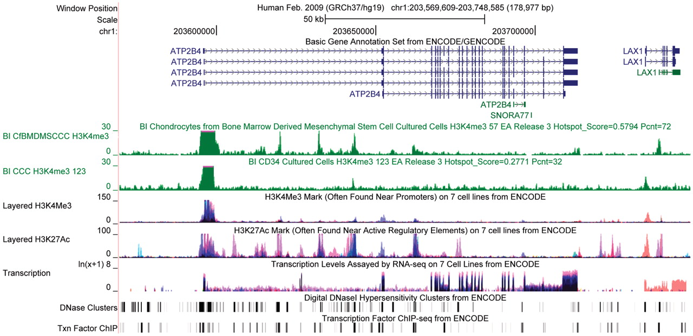
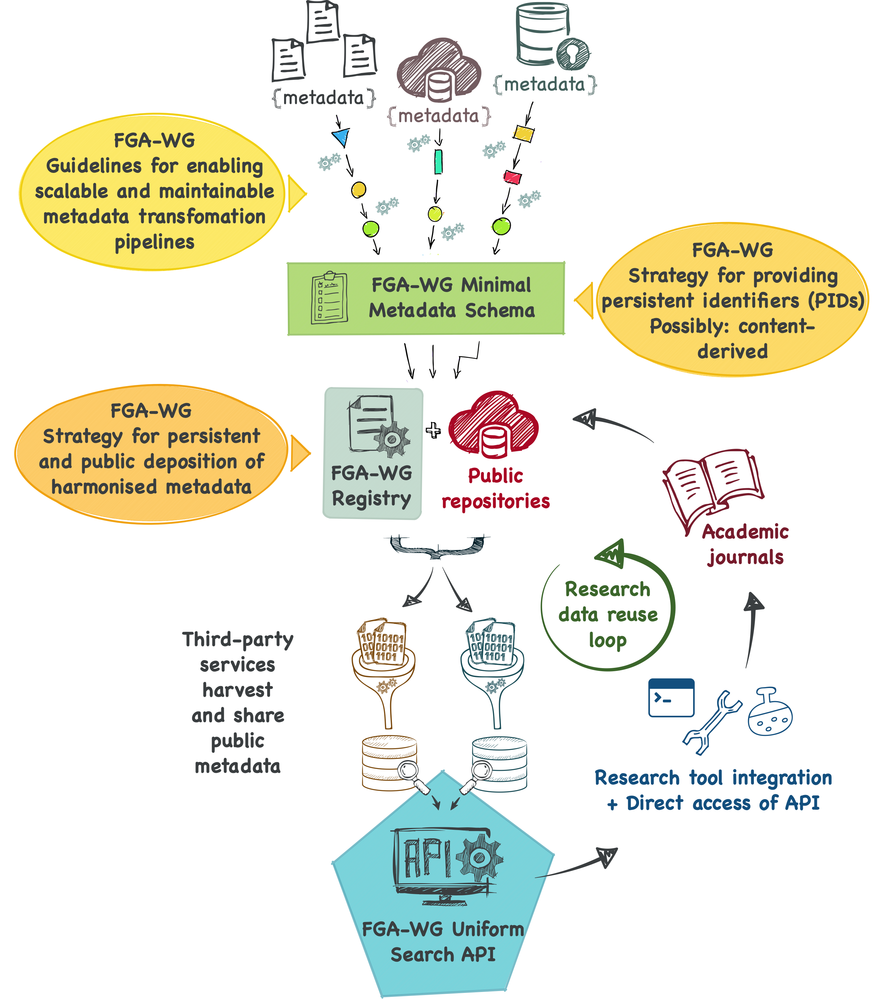

---
search:
  boost: 10.0
---

# FAIRification of Genomic Annotations Schema

## About the FGA-WG

The **FAIRification of Genomic Annotations Working Group (FGA-WG)** is part of the [Research Data Alliance (RDA)](https://www.rd-alliance.org/) and develops community standards for harmonizing and discovering genomic annotation metadata at scale.

### The Challenge

Immense resources have been invested in generating genomic annotation data through major consortia such as [ENCODE](https://www.encodeproject.org/), [IHEC](https://ihec-epigenomes.org/), [FANTOM](https://fantom.gsc.riken.jp/), and [FAANG](https://data.faang.org/home), as well as countless smaller research projects. However, this metadata is typically provided through different data portals, each using distinct metadata models, interfaces, and schemas. This fragmentation makes it time-consuming and error-prone to harmonize and discover annotations across sources.

The harmonization process is often implemented in ad hoc scripts that are difficult to maintain and scale, even though many operations are common across different sources.

{width="500"}
/// caption
Example of genomic annotations (tracks) from the ENCODE consortium imported into the [UCSC Genome Browser](http://genome.ucsc.edu/). From Rosenbloom et. al. (2011). ["ENCODE whole-genome data in the UCSC genome browser: update 2012."](https://dx.doi.org/10.1093/nar/gkr1012) Nucleic acids research. 40. D912-7. License: [CC BY-NC 3.0](https://creativecommons.org/licenses/by-nc/3.0/)
///

### Our Mission

The FGA-WG aims to produce a set of recommendations that together define a **community-oriented infrastructure** to make it easier to discover and reuse genomic annotations in a range of contexts. We do this by:

- Creating standardized metadata schemas that respect the diversity of data sources
- Enabling [FAIR (Findable, Accessible, Interoperable, Reusable)](https://www.go-fair.org/fair-principles/) principles for genomic annotation data
- Supporting metadata harmonization and transformation pipelines
- Facilitating data-driven discovery and analysis

## Planned FAIRification infrastructure & WG deliverables

{width="500"}
/// caption
Planned infrastructure of the [FAIRification of Genomic Annotations WG](https://www.rd-alliance.org/groups/fairification-genomic-annotations-wg)
///

## The FGA-WG Schema

This documentation describes the LinkML schema developed by the FGA-WG for metadata harmonization of genomic annotation data and associated experimental/analysis information.

The schema provides a unified, coordinate-based data model suitable for functional genomics analysis, visualization in genome browsers, and emerging applications in pangenomics and AI-driven discovery.

### Key Features

The schema provides a comprehensive model for describing:

- **Genomic Annotation Files**: Detailed metadata about genome annotation files including format, content, and genome assembly
- **Experiments & Sequencing**: Information about sequencing experiments, assay types, and protocols
- **Analysis & Processing**: Computational analyses and workflows applied to data
- **Biospecimens & Donors**: Sample information and donor/organism details
- **Quality Assessment**: Quality metrics and assessment results
- **File Collections**: Grouping related files by selection criteria
- **Provenance & Versioning**: Complete tracking of data lineage and versions

The schema is designed to support:
- Visualization in genome browsers using reference genomes as one-dimensional coordinate systems
- Non-visual analysis and computational workflows
- Data-driven discovery approaches
- Future applications including pangenomics and AI-driven functional annotation analysis

## Schema Highlights

### Core Entities

- **[Bundle](Bundle.md)**: The root container for all metadata in a bundle
- **[BundleMetadata](BundleMetadata.md)**: Top-level metadata about the bundle itself
- **[FileCollection](FileCollection.md)**: Groupings of related files
- **[File](File.md)**: Individual data files (in general, for e.g. FASTA files)
- **[GenomicAnnotationFile](GenomicAnnotationFile.md)**: Specialized file type for genome annotation data
- **[Experiment](Experiment.md)**: Sequencing experiments producing data
- **[Analysis](Analysis.md)**: Computational processing of data
- **[Sample](Sample.md)**: Biospecimens used in experiments
- **[Study](Study.md)**: Research studies containing experiments

### Supporting Entities

- **[GenomeAssembly](GenomeAssembly.md)**: Reference genome information
- **[Donor](Donor.md)**: Organism/donor information
- **[Contact](Contact.md)**: People and organizations involved
- **[QualityAssessment](QualityAssessment.md)**: Quality metrics for files
- **[Term](Term.md)**: Ontology term references

## Standards & References

This schema builds upon and integrates with:

- [GA4GH DRS (Data Repository Service)](https://ga4gh.github.io/data-repository-service-schemas/) specification
- [GA4GH RefGet specification](https://github.com/ga4gh/refget) for sequence digests
- [LinkML](https://linkml.io/) for schema definition and validation
- Established bioinformatics ontologies (GO, SO, EFO, OBI, etc.)

## Get Started

### Exploring the Schema

Browse the documentation using the navigation menu above:

1. **Start with the [Bundle](Bundle.md) class** - This is the root class representing a complete harmonized metadata document for genome annotation files
2. **Review the [Schema Overview](overview.md)** - Visual representations of the schema structure and relationships
3. **Browse the Classes** - Explore individual entity types and their properties in the Classes section
4. **Look up Slots** - Find specific metadata fields in the Slots section
5. **Check the Schema Details** - Complete table of contents for all schema elements

### Getting Involved

The FGA-WG actively welcomes contributions and participation:

- **Join our meetings**: Currently held every 1st and 3rd Wednesday of the month at 2pm UTC
- **Share your expertise**: We value knowledge and experience from all domains
- **Contribute feedback**: Help shape the schema and infrastructure based on real-world needs
- **Build tools**: Develop software that implements and utilizes the FGA-WG standards

We believe in not reinventing the wheel – if you have relevant knowledge to share, please join us!

---

*For more information about the RDA FGA-WG, visit [https://www.rd-alliance.org/groups/fairification-genomic-annotations-wg](https://www.rd-alliance.org/groups/fairification-genomic-annotations-wg)*

