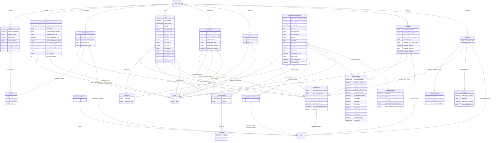

```mermaid
erDiagram
AccessMethod {
    AccessMethods access_method  
    string region  
}
AccessURL {
    stringList headers  
    uri url  
}
Analysis {
    string analysis_description  
    curie analysis_external_id  
    curie analysis_id  
    string analysis_label  
    string analysis_main_tool_version  
    uriorcurie analysis_protocol  
    curie analysis_study_ref  
    uriorcurie analysis_workflow  
}
Any {

}
AssessmentValue {
    string key  
}
Checksum {
    string checksum  
    string checksum_type  
}
Contact {
    string name  
    curie contact_id  
    string email  
}
Deposit {
    datetime deposit_first_created  
    curie deposit_id  
    datetime deposit_last_changed  
    curie deposit_versioned_id  
}
Document {
    string document_label  
}
Donor {
    curie donor_external_id  
    curie donor_id  
}
Experiment {
    string design_description  
    curie experiment_external_id  
    curie experiment_id  
    string experiment_label  
    curie experiment_study_ref  
    uriorcurie sequencing_protocol  
}
File {
    datetime created_time  
    OutputType data_content  
    uri drs_uri  
    string file_description  
    curie file_external_id  
    curie file_id  
    string file_label  
    string file_name  
    integer file_size  
    string file_version  
    curieList filecollection_refs  
    string mime_type  
    uriorcurie run_provenance  
    datetime updated_time  
}
FileCollection {
    curie deposit_versioned_ref  
    curie filecollection_external_id  
    curie filecollection_id  
    string filecollection_label  
}
GenomeAssembly {
    stringList accessions  
    curieList aliases  
    curie seqcol_digest  
    curie seqcol_ordered_coord_system  
    curie seqcol_unordered_coord_system  
}
GenomicAnnotationFile {
    curie genomic_annotation_digest  
    datetime created_time  
    OutputType data_content  
    uri drs_uri  
    string file_description  
    curie file_external_id  
    curie file_id  
    string file_label  
    string file_name  
    integer file_size  
    string file_version  
    curieList filecollection_refs  
    string mime_type  
    uriorcurie run_provenance  
    datetime updated_time  
}
InputSource {
    stringList biological_replicate_labels  
    date date_of_retrieval  
    uriorcurie inputsource_external_ref  
    curie inputsource_ref  
    uriorcurie qualified_relation  
    stringList technical_replicate_labels  
    string version  
}
OntologyVersions {
    string namespace  
    uri ontology_url  
    uri versioned_ontology_url  
}
QualityAssessment {
    uri assessment_details_url  
}
Sample {
    BiospecimenClassification biospecimen_classification  
    string donor_age  
    string donor_clinical_information  
    curie donor_organism_ref  
    datetime sample_collection_date  
    string sample_collection_location  
    string sample_description  
    curie sample_external_id  
    curie sample_id  
    string sample_label  
    uri sampling_protocol  
}
Study {
    uriorcurie project_external_ref  
    string project_name  
    curieList publications  
    string study_abstract  
    curie study_external_id  
    curie study_id  
    string study_title  
}
Term {
    curie id  
    string label  
}
TopLevel {

}
TrackGeometry {
    DataTypes edge_weight_type  
    boolean edges_are_directed  
    boolean edges_denote_parents  
    boolean edges_have_weights  
    boolean elements_circular  
    boolean elements_overlapping  
    boolean has_edges  
    boolean has_gaps  
    boolean has_lengths  
    boolean has_names  
    boolean has_strands  
    boolean has_values  
    boolean lengths_constant  
    DataTypes value_type  
}

AccessMethod ||--|| AccessURL : "access_url"
Analysis ||--|o Any : "analysis_main_tool"
Analysis ||--|| Term : "analysis_type"
Analysis ||--}| InputSource : "analysis_input_sources"
AssessmentValue ||--|| Any : "value"
Document ||--|o Any : "document_description"
Document ||--|o Deposit : "document_deposit"
Document ||--}o InputSource : "document_input_sources"
Document ||--}| OntologyVersions : "document_ontology_versions"
Donor ||--|o Term : "sex"
Donor ||--|| Term : "species_taxon"
Experiment ||--|o Term : "antibody_target, instrument, library_layout"
Experiment ||--|| Term : "assay_type, molecule_type"
Experiment ||--}o Term : "biological_processes"
Experiment ||--}| InputSource : "experiment_samples"
File ||--|| Term : "file_type"
File ||--}o QualityAssessment : "quality_assessments"
File ||--}| AccessMethod : "access_methods"
File ||--}| Checksum : "checksums"
File ||--}| InputSource : "file_input_sources"
FileCollection ||--|o Any : "filecollection_description"
FileCollection ||--|o Contact : "filecollection_contact"
FileCollection ||--}o InputSource : "filecollection_input_sources"
GenomicAnnotationFile ||--|| GenomeAssembly : "genome_assembly"
GenomicAnnotationFile ||--|| Term : "file_type"
GenomicAnnotationFile ||--|| TrackGeometry : "track_geometry"
GenomicAnnotationFile ||--}o QualityAssessment : "quality_assessments"
GenomicAnnotationFile ||--}| AccessMethod : "access_methods"
GenomicAnnotationFile ||--}| Checksum : "checksums"
GenomicAnnotationFile ||--}| InputSource : "file_input_sources"
GenomicAnnotationFile ||--}| Term : "sequence_features"
InputSource ||--}o Any : "database_accessions"
QualityAssessment ||--|| Any : "assessment_method, assessment_values"
Sample ||--|o Term : "cell_line, cell_type, donor_development_stage, organism_tissue, phenotype"
Sample ||--}o Term : "other_biospecimen"
Study ||--|o Contact : "study_contact"
TopLevel ||--|| Document : "document"
TopLevel ||--}o Analysis : "analyses"
TopLevel ||--}o Donor : "donors"
TopLevel ||--}o Experiment : "experiments"
TopLevel ||--}o File : "files"
TopLevel ||--}o FileCollection : "file_collections"
TopLevel ||--}o Sample : "samples"
TopLevel ||--}o Study : "studies"

```

